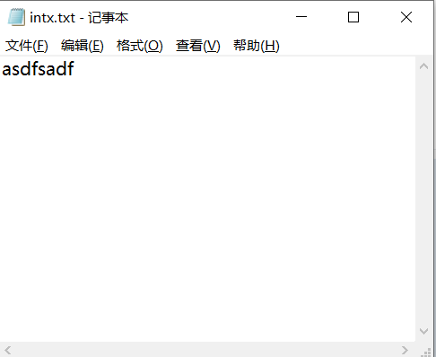
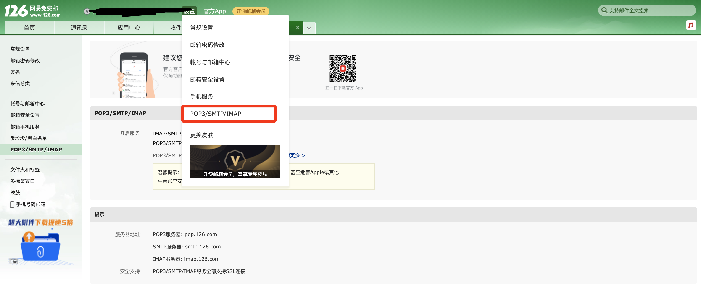
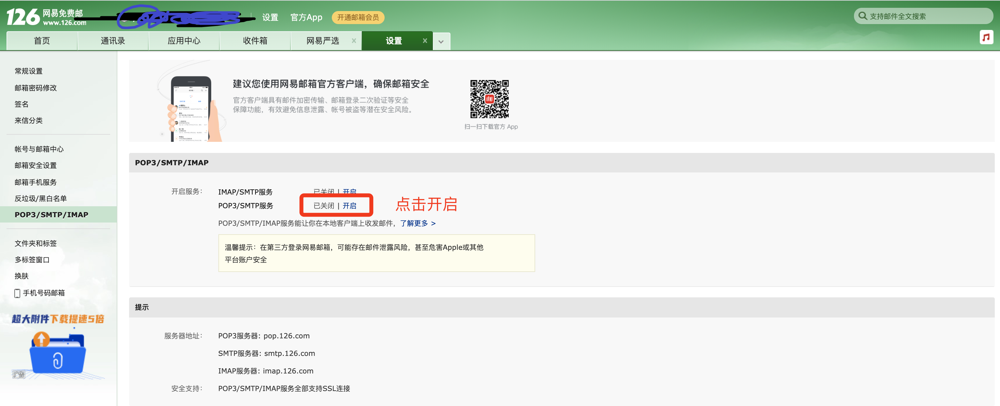

# 第二模块

- 文件处理
  - txt文本文件
  - csv文件
  - ini文件
  - xml文件
  - Excel表格文件
- 函数
- 模块

## day9 文件处理

### 1.文件操作

在学习文件操作之前，先来回顾一下编码的相关以及先关数据类型的知识。

- 字符串类型（str），在程序中用于表示文字信息，本质上是unicode编码中的二进制。

  ```python
  name = "杨昌辉"
  ```

- 字节类型（bytes）

  - 可表示文字信息，本质上是utf-8/gbk等编码的二进制（对unicode进行压缩，方便文件存储和网络传输。）

    ```python
    name = "杨昌辉"
    data = name.encode('utf-8')
    print(data) # b'\xe6\xad\xa6\xe6\xb2\x9b\xe9\xbd\x90'
    
    result = data.decode('utf-8')
    print(result) # "杨昌辉"
    ```

  - 可表示原始二进制（图片、文件等信息）

#### 1.1 读文件

读文本文件

rb是以二进制的模式打开的，也可以在后面加 .decode来解码成文本

rt是以文本打开的，所以要encoding来解码



绝对路径：C:\Users\cbzll\Deskto\intx.txt

相对路径：intx.txt		注：相对路径必须与py文件在一个文件夹才行

```python
#普通：读取文件分三步
#1.打开文件
#2.读取文件
#3.关闭文件

#1
f = open("路径(绝对路径，相对路径)",mode = "rb")#rb 为 字节打开
#2
data = f.read()
#3
d.close()

print(data)#字节模式
text = data.decode("utf-8")
print(text)#文字模式


#上下文管理
with open(r"C:\Users\cbzll\Desktop/intx.txt",mode ="rb") as f:
	a = f.read()
	print(a)

#输出
asdfsadf

#或者
>>> with open(r"C:\Users\cbzll\Desktop/intx.txt",mode ="rt",encoding="utf-8") as f:
	a = f.read()
	print(a)

#输出
asdfsadf
```

#### 1.2 写文件

写入文本文件

```python
# 1.打开文件
file_object = open("路径", mode='wb')	# 模式：wb（要求写入的内容需要是字节类型）

# 2.写入内容
file_object.write("杨昌辉".encode("utf-8"))

# 3.文件关闭
file_object.close()

#上下文管理
#写二进制的东西(视频，相片)可以这样但是这个写文字不好
with open("路径"，mode = "wb") as f:
    f.write("llc".encode("utf-8"))#写照片就不用encode了
    
#写文字
with open("路径",mode = "wb",encoding="utf-8") as f:
    f.write("llc")
    
print(f)#文件里就剩下llc了
```

注意：w是写入，但是它会将文本情况然后在写入,说多了都是泪啊

​			a是追加，不会清空文本，

​			**注意!!!!!!!!!!!!!!!!!!!!!**


写图片，视频等文件：

```python
#拷贝一份属于
f1 = open('a1.png',mode='rb')
content = f1.read()
f1.close()

f2 = open('a2.png',mode='wb')
f2.write(content)
f2.close()

#上下文管理
with open("原照片路径"，mode = "wb") as f,open("拷贝照片路径"，mode = "wb") as f1:
    a = f.read()
    f1.write(a)
```


### 2.csv格式文件

**逗号分隔值**（Comma-Separated Values，**CSV**，有时也称为**字符分隔值**，因为分隔字符也可以不是逗号），其文件以纯文本形式存储**表格**数据（数字和文本）

就是用逗号隔开的 “文本文件”

用文本工具就行

### 3.ini格式文件

ini文件是Initialization File的缩写，平时用于存储软件的的配置文件。例如：MySQL数据库的配置文件。

```ini
[mysqld]
datadir=/var/lib/mysql
socket=/var/lib/mysql/mysql.sock
log-bin=py-mysql-bin
character-set-server=utf8
collation-server=utf8_general_ci
log-error=/var/log/mysqld.log
# Disabling symbolic-links is recommended to prevent assorted security risks
symbolic-links=0

[mysqld_safe]
log-error=/var/log/mariadb/mariadb.log
pid-file=/var/run/mariadb/mariadb.pid

[client]
default-character-set=utf8
```

这种格式是可以直接使用open来出来，考虑到自己处理比较麻烦，所以Python为我们提供了更为方便的方式。

```python
import configparser

config = configparser.ConfigParser()
config.read('files/my.ini', encoding='utf-8')
# config.read('/Users/wupeiqi/PycharmProjects/luffyCourse/day09/files/my.ini', encoding='utf-8')

# 1.获取所有的节点
"""
result = config.sections()
print(result)  # ['mysqld', 'mysqld_safe', 'client']
"""

# 2.获取节点下的键值
"""
result = config.items("mysqld_safe")
print(result)  # [('log-error', '/var/log/mariadb/mariadb.log'), ('pid-file', '/var/run/mariadb/mariadb.pid')]

for key, value in config.items("mysqld_safe"):
    print(key, value)
"""

# 3.获取某个节点下的键对应的值
"""
result = config.get("mysqld","collation-server")
print(result)
"""

# 4.其他

# 4.1 是否存在节点
# v1 = config.has_section("client")
# print(v1)

# 4.2 添加一个节点
# config.add_section("group")
# config.set('group','name','wupeiqi')
# config.set('client','name','wupeiqi')
# config.write(open('files/new.ini', mode='w', encoding='utf-8'))

# 4.3 删除
# config.remove_section('client')
# config.remove_option("mysqld", "datadir")
# config.write(open('files/new.ini', mode='w', encoding='utf-8'))
```

- 读取所有节点

  ```python
  import configparser
  
  config = configparser.ConfigParser()
  config.read('/Users/wupeiqi/PycharmProjects/luffyCourse/day09/files/my.conf', encoding='utf-8')
  # config.read('my.conf', encoding='utf-8')
  ret = config.sections()
  print(ret) 
  
  >>输出
  ['mysqld', 'mysqld_safe', 'client']
  ```

- 读取节点下的键值

  ```python
  import configparser
  
  config = configparser.ConfigParser()
  config.read('/Users/wupeiqi/PycharmProjects/luffyCourse/day09/files/my.conf', encoding='utf-8')
  # config.read('my.conf', encoding='utf-8')
  item_list = config.items("mysqld_safe")
  print(item_list) 
  
  >>输出
  [('log-error', '/var/log/mariadb/mariadb.log'), ('pid-file', '/var/run/mariadb/mariadb.pid')]
  ```

- 读取节点下值（根据 节点+键 ）

  ```python
  import configparser
  
  config = configparser.ConfigParser()
  config.read('/Users/wupeiqi/PycharmProjects/luffyCourse/day09/files/my.conf', encoding='utf-8')
  
  value = config.get('mysqld', 'log-bin')
  print(value)
  
  >>输出
  py-mysql-bin
  ```

- 检查、删除、添加节点

  ```python
  import configparser
  
  config = configparser.ConfigParser()
  config.read('/Users/wupeiqi/PycharmProjects/luffyCourse/day09/files/my.conf', encoding='utf-8')
  # config.read('my.conf', encoding='utf-8')
  
  
  # 检查
  has_sec = config.has_section('mysqld')
  print(has_sec)
  
  # 添加节点
  config.add_section("SEC_1")
  # 节点中设置键值
  config.set('SEC_1', 'k10', "123")
  config.set('SEC_1', 'name', "哈哈哈哈哈")
  
  config.add_section("SEC_2")
  config.set('SEC_2', 'k10', "123")
  # 内容写入新文件
  config.write(open('/Users/wupeiqi/PycharmProjects/luffyCourse/day09/files/xxoo.conf', 'w'))
  
  
  # 删除节点
  config.remove_section("SEC_2")
  # 删除节点中的键值
  config.remove_option('SEC_1', 'k10')
  config.write(open('/Users/wupeiqi/PycharmProjects/luffyCourse/day09/files/new.conf', 'w'))
  ```

  

### 4.XML格式文件

[可扩展标记语言](https://baike.baidu.com/item/可扩展标记语言/2885849)，是一种简单的数据存储语言，XML 被设计用来传输和存储数据。

- 存储，可用来存放配置文件，例如：java的配置文件。
- 传输，网络传输时以这种格式存在，例如：早期ajax传输的数据、soap协议等。

```xml
<data>
    <country name="Liechtenstein">
        <rank updated="yes">2</rank>
        <year>2023</year>
        <gdppc>141100</gdppc>
        <neighbor direction="E" name="Austria" />
        <neighbor direction="W" name="Switzerland" />
    </country>
    <country name="Singapore">
        <rank updated="yes">5</rank>
        <year>2026</year>
        <gdppc>59900</gdppc>
        <neighbor direction="N" name="Malaysia" />
    </country>
    <country name="Panama">
        <rank updated="yes">69</rank>
        <year>2026</year>
        <gdppc>13600</gdppc>
        <neighbor direction="W" name="Costa Rica" />
        <neighbor direction="E" name="Colombia" />
    </country>
</data>
```

注意：在Python开发中用的相对来比较少，大家作为了解即可（后期课程在讲解微信支付、微信公众号消息处理 时会用到基于xml传输数据）。

例如：https://developers.weixin.qq.com/doc/offiaccount/Message_Management/Receiving_standard_messages.html

#### 4.1 读取文件和内容

```python
from xml.etree import ElementTree as ET

# ET去打开xml文件
tree = ET.parse("files/xo.xml")

# 获取根标签
root = tree.getroot()

print(root) # <Element 'data' at 0x7f94e02763b0>
```

```python
from xml.etree import ElementTree as ET

content = """
<data>
    <country name="Liechtenstein">
        <rank updated="yes">2</rank>
        <year>2023</year>
        <gdppc>141100</gdppc>
        <neighbor direction="E" name="Austria" />
        <neighbor direction="W" name="Switzerland" />
    </country>
     <country name="Panama">
        <rank updated="yes">69</rank>
        <year>2026</year>
        <gdppc>13600</gdppc>
        <neighbor direction="W" name="Costa Rica" />
        <neighbor direction="E" name="Colombia" />
    </country>
</data>
"""

root = ET.XML(content)
print(root)  # <Element 'data' at 0x7fdaa019cea0>
```

#### 4.2 读取节点数据

```python
from xml.etree import ElementTree as ET

content = """
<data>
    <country name="Liechtenstein" id="999" >
        <rank>2</rank>
        <year>2023</year>
        <gdppc>141100</gdppc>
        <neighbor direction="E" name="Austria" />
        <neighbor direction="W" name="Switzerland" />
    </country>
     <country name="Panama">
        <rank>69</rank>
        <year>2026</year>
        <gdppc>13600</gdppc>
        <neighbor direction="W" name="Costa Rica" />
        <neighbor direction="E" name="Colombia" />
    </country>
</data>
"""

# 获取根标签 data
root = ET.XML(content)

country_object = root.find("country")
print(country_object.tag, country_object.attrib)
gdppc_object = country_object.find("gdppc")
print(gdppc_object.tag,gdppc_object.attrib,gdppc_object.text)
```

```python
from xml.etree import ElementTree as ET

content = """
<data>
    <country name="Liechtenstein">
        <rank>2</rank>
        <year>2023</year>
        <gdppc>141100</gdppc>
        <neighbor direction="E" name="Austria" />
        <neighbor direction="W" name="Switzerland" />
    </country>
     <country name="Panama">
        <rank>69</rank>
        <year>2026</year>
        <gdppc>13600</gdppc>
        <neighbor direction="W" name="Costa Rica" />
        <neighbor direction="E" name="Colombia" />
    </country>
</data>
"""

# 获取根标签 data
root = ET.XML(content)

# 获取data标签的孩子标签
for child in root:
    # child.tag = conntry
    # child.attrib = {"name":"Liechtenstein"}
    print(child.tag, child.attrib)
    for node in child:
        print(node.tag, node.attrib, node.text)
```

```python
from xml.etree import ElementTree as ET

content = """
<data>
    <country name="Liechtenstein">
        <rank>2</rank>
        <year>2023</year>
        <gdppc>141100</gdppc>
        <neighbor direction="E" name="Austria" />
        <neighbor direction="W" name="Switzerland" />
    </country>
     <country name="Panama">
        <rank>69</rank>
        <year>2026</year>
        <gdppc>13600</gdppc>
        <neighbor direction="W" name="Costa Rica" />
        <neighbor direction="E" name="Colombia" />
    </country>
</data>
"""

root = ET.XML(content)

for child in root.iter('year'):
    print(child.tag, child.text)
```

```python
from xml.etree import ElementTree as ET

content = """
<data>
    <country name="Liechtenstein">
        <rank>2</rank>
        <year>2023</year>
        <gdppc>141100</gdppc>
        <neighbor direction="E" name="Austria" />
        <neighbor direction="W" name="Switzerland" />
    </country>
     <country name="Panama">
        <rank>69</rank>
        <year>2026</year>
        <gdppc>13600</gdppc>
        <neighbor direction="W" name="Costa Rica" />
        <neighbor direction="E" name="Colombia" />
    </country>
</data>
"""

root = ET.XML(content)
v1 = root.findall('country')
print(v1)

v2 = root.find('country').find('rank')
print(v2.text)
```


#### 4.3 修改和删除节点

```python
from xml.etree import ElementTree as ET

content = """
<data>
    <country name="Liechtenstein">
        <rank>2</rank>
        <year>2023</year>
        <gdppc>141100</gdppc>
        <neighbor direction="E" name="Austria" />
        <neighbor direction="W" name="Switzerland" />
    </country>
     <country name="Panama">
        <rank>69</rank>
        <year>2026</year>
        <gdppc>13600</gdppc>
        <neighbor direction="W" name="Costa Rica" />
        <neighbor direction="E" name="Colombia" />
    </country>
</data>
"""

root = ET.XML(content)

# 修改节点内容和属性
rank = root.find('country').find('rank')
print(rank.text)
rank.text = "999"
rank.set('update', '2020-11-11')
print(rank.text, rank.attrib)
############ 保存文件 ############
tree = ET.ElementTree(root)
tree.write("new.xml", encoding='utf-8')


# 删除节点
root.remove( root.find('country') )
print(root.findall('country'))

############ 保存文件 ############
tree = ET.ElementTree(root)
tree.write("newnew.xml", encoding='utf-8')
```


#### 4.4 构建文档

```xml
<home>
    <son name="儿1">
        <grandson name="儿11"></grandson>
        <grandson name="儿12"></grandson>
    </son>
    <son name="儿2"></son>
</home>
```


```python
from xml.etree import ElementTree as ET

# 创建根标签
root = ET.Element("home")

# 创建节点大儿子
son1 = ET.Element('son', {'name': '儿1'})
# 创建小儿子
son2 = ET.Element('son', {"name": '儿2'})

# 在大儿子中创建两个孙子
grandson1 = ET.Element('grandson', {'name': '儿11'})
grandson2 = ET.Element('grandson', {'name': '儿12'})
son1.append(grandson1)
son1.append(grandson2)

# 把儿子添加到根节点中
root.append(son1)
root.append(son2)

tree = ET.ElementTree(root)
tree.write('oooo.xml', encoding='utf-8', short_empty_elements=False)
```


```xml
<famliy>
    <son name="儿1">
        <grandson name="儿11"></grandson>
        <grandson name="儿12"></grandson>
    </son>
    <son name="儿2"></son>
</famliy>
```

```python
from xml.etree import ElementTree as ET

# 创建根节点
root = ET.Element("famliy")


# 创建大儿子
son1 = root.makeelement('son', {'name': '儿1'})
# 创建小儿子
son2 = root.makeelement('son', {"name": '儿2'})

# 在大儿子中创建两个孙子
grandson1 = son1.makeelement('grandson', {'name': '儿11'})
grandson2 = son1.makeelement('grandson', {'name': '儿12'})

son1.append(grandson1)
son1.append(grandson2)


# 把儿子添加到根节点中
root.append(son1)
root.append(son2)

tree = ET.ElementTree(root)
tree.write('oooo.xml',encoding='utf-8')
```


```xml
<famliy>
	<son name="儿1">
    	<age name="儿11">孙子</age>
    </son>
	<son name="儿2"></son>
</famliy>
```

```python
from xml.etree import ElementTree as ET


# 创建根节点
root = ET.Element("famliy")


# 创建节点大儿子
son1 = ET.SubElement(root, "son", attrib={'name': '儿1'})
# 创建小儿子
son2 = ET.SubElement(root, "son", attrib={"name": "儿2"})

# 在大儿子中创建一个孙子
grandson1 = ET.SubElement(son1, "age", attrib={'name': '儿11'})
grandson1.text = '孙子'


et = ET.ElementTree(root)  #生成文档对象
et.write("test.xml", encoding="utf-8")
```


```xml
<user><![CDATA[你好呀]]</user>
```

```python
from xml.etree import ElementTree as ET

# 创建根节点
root = ET.Element("user")
root.text = "<![CDATA[你好呀]]"

et = ET.ElementTree(root)  # 生成文档对象
et.write("test.xml", encoding="utf-8")
```


案例：

```python
content = """<xml>
    <ToUserName><![CDATA[gh_7f083739789a]]></ToUserName>
    <FromUserName><![CDATA[oia2TjuEGTNoeX76QEjQNrcURxG8]]></FromUserName>
    <CreateTime>1395658920</CreateTime>
    <MsgType><![CDATA[event]]></MsgType>
    <Event><![CDATA[TEMPLATESENDJOBFINISH]]></Event>
    <MsgID>200163836</MsgID>
    <Status><![CDATA[success]]></Status>
</xml>"""

from xml.etree import ElementTree as ET

info = {}
root = ET.XML(content)
for node in root:
    # print(node.tag,node.text)
    info[node.tag] = node.text
print(info)
```


### 5.Excel格式文件

Python内部未提供处理Excel文件的功能，想要在Python中操作Excel需要按照第三方的模块。

```
pip install openpyxl
```

此模块中集成了Python操作Excel的相关功能，接下来我们就需要去学习该模块提供的相关功能即可。


#### 5.1 读Excel

- 读sheet

  ```python
  from openpyxl import load_workbook
  
  wb = load_workbook("files/p1.xlsx")
  
  # sheet相关操作
  
  # 1.获取excel文件中的所有sheet名称
  """
  print(wb.sheetnames) # ['数据导出', '用户列表', 'Sheet1', 'Sheet2']
  """
  
  # 2.选择sheet，基于sheet名称
  """
  sheet = wb["数据导出"]
  cell = sheet.cell(1, 2)
  print(cell.value)
  """
  
  # 3.选择sheet，基于索引位置
  """
  sheet = wb.worksheets[0]
  cell = sheet.cell(1,2)
  print(cell.value)
  """
  
  # 4.循环所有的sheet
  """
  for name in wb.sheetnames:
      sheet = wb[name]
      cell = sheet.cell(1, 1)
      print(cell.value)
  """
  """
  for sheet in wb.worksheets:
      cell = sheet.cell(1, 1)
      print(cell.value)
  """
  """
  for sheet in wb:
      cell = sheet.cell(1, 1)
      print(cell.value)
  """
  ```

- 读sheet中单元格的数据

  ```python
  from openpyxl import load_workbook
  
  wb = load_workbook("files/p1.xlsx")
  sheet = wb.worksheets[0]
  
  # 1.获取第N行第N列的单元格(位置是从1开始）
  """
  cell = sheet.cell(1, 1)
  
  print(cell.value)
  print(cell.style)
  print(cell.font)
  print(cell.alignment)
  """
  
  # 2.获取某个单元格
  """
  c1 = sheet["A2"]
  print(c1.value)
  
  c2 = sheet['D4']
  print(c2.value)
  """
  
  # 3.第N行所有的单元格
  """
  for cell in sheet[1]:
      print(cell.value)
  """
  
  # 4.所有行的数据（获取某一列数据）
  """
  for row in sheet.rows:
      print(row[0].value, row[1].value)
  """
  
  # 5.获取所有列的数据
  """
  for col in sheet.columns:
      print(col[1].value)
  """
  ```

- 读合并的单元格

  

  ```python
  from openpyxl import load_workbook
  
  wb = load_workbook("files/p1.xlsx")
  sheet = wb.worksheets[2]
  
  # 获取第N行第N列的单元格(位置是从1开始）
  c1 = sheet.cell(1, 1)
  print(c1)  # <Cell 'Sheet1'.A1>
  print(c1.value) # 用户信息
  
  c2 = sheet.cell(1, 2)
  print(c2)  # <MergedCell 'Sheet1'.B1>
  print(c2.value) # None
  
  ```

  ```python
  from openpyxl import load_workbook
  
  wb = load_workbook('files/p1.xlsx')
  sheet = wb.worksheets[2]
  for row in sheet.rows:
      print(row)
  ```

  ```
  >>> 输出结果
  (<Cell 'Sheet1'.A1>, <MergedCell 'Sheet1'.B1>, <Cell 'Sheet1'.C1>)
  (<Cell 'Sheet1'.A2>, <Cell 'Sheet1'.B2>, <Cell 'Sheet1'.C2>)
  (<Cell 'Sheet1'.A3>, <Cell 'Sheet1'.B3>, <Cell 'Sheet1'.C3>)
  (<MergedCell 'Sheet1'.A4>, <Cell 'Sheet1'.B4>, <Cell 'Sheet1'.C4>)
  (<Cell 'Sheet1'.A5>, <Cell 'Sheet1'.B5>, <Cell 'Sheet1'.C5>)
  ```

  

#### 5.1 写Excel

在Excel中想要写文件，大致要分为在：

- 原Excel文件基础上写内容。

  ```python
  from openpyxl import load_workbook
  
  wb = load_workbook('files/p1.xlsx')
  sheet = wb.worksheets[0]
  
  # 找到单元格，并修改单元格的内容
  cell = sheet.cell(1, 1)
  cell.value = "新的开始"
  
  # 将excel文件保存到p2.xlsx文件中
  wb.save("files/p2.xlsx")
  ```

- 新创建Excel文件写内容。

  ```python
  from openpyxl import workbook
  
  # 创建excel且默认会创建一个sheet（名称为Sheet）
  wb = workbook.Workbook()
  
  sheet = wb.worksheets[0] # 或 sheet = wb["Sheet"]
  
  # 找到单元格，并修改单元格的内容
  cell = sheet.cell(1, 1)
  cell.value = "新的开始"
  
  # 将excel文件保存到p2.xlsx文件中
  wb.save("files/p2.xlsx")
  ```


在了解了如何读取Excel和创建Excel之后，后续对于Excel中的sheet和cell操作基本上都相同。

```python
from openpyxl import workbook

wb = workbook.Workbook() # Sheet

# 1. 修改sheet名称
"""
sheet = wb.worksheets[0]
sheet.title = "数据集"
wb.save("p2.xlsx")
"""

# 2. 创建sheet并设置sheet颜色
"""
sheet = wb.create_sheet("工作计划", 0)
sheet.sheet_properties.tabColor = "1072BA"
wb.save("p2.xlsx")
"""

# 3. 默认打开的sheet
"""
wb.active = 0
wb.save("p2.xlsx")
"""

# 4. 拷贝sheet
"""
sheet = wb.create_sheet("工作计划")
sheet.sheet_properties.tabColor = "1072BA"

new_sheet = wb.copy_worksheet(wb["Sheet"])
new_sheet.title = "新的计划"
wb.save("p2.xlsx")
"""

# 5.删除sheet
"""
del wb["用户列表"]
wb.save('files/p2.xlsx')
"""
```

```python
from openpyxl import load_workbook
from openpyxl.styles import Alignment, Border, Side, Font, PatternFill, GradientFill


wb = load_workbook('files/p1.xlsx')

sheet = wb.worksheets[1]

# 1. 获取某个单元格，修改值
"""
cell = sheet.cell(1, 1)
cell.value = "开始"
wb.save("p2.xlsx")
"""

# 2.  获取某个单元格，修改值
"""
sheet["B3"] = "Alex"
wb.save("p2.xlsx")
"""

# 3. 获取某些单元格，修改值
"""
cell_list = sheet["B2":"C3"]
for row in cell_list:
    for cell in row:
        cell.value = "新的值"
wb.save("p2.xlsx")
"""

# 4. 对齐方式
"""
cell = sheet.cell(1, 1)

# horizontal，水平方向对齐方式："general", "left", "center", "right", "fill", "justify", "centerContinuous", "distributed"
# vertical，垂直方向对齐方式："top", "center", "bottom", "justify", "distributed"
# text_rotation，旋转角度。
# wrap_text，是否自动换行。
cell.alignment = Alignment(horizontal='center', vertical='distributed', text_rotation=45, wrap_text=True)
wb.save("p2.xlsx")
"""

# 5. 边框
# side的style有如下：dashDot','dashDotDot', 'dashed','dotted','double','hair', 'medium', 'mediumDashDot', 'mediumDashDotDot','mediumDashed', 'slantDashDot', 'thick', 'thin'
"""
cell = sheet.cell(9, 2)
cell.border = Border(
    top=Side(style="thin", color="FFB6C1"), 
    bottom=Side(style="dashed", color="FFB6C1"),
    left=Side(style="dashed", color="FFB6C1"),
    right=Side(style="dashed", color="9932CC"),
    diagonal=Side(style="thin", color="483D8B"),  # 对角线
    diagonalUp=True,  # 左下 ~ 右上
    diagonalDown=True  # 左上 ~ 右下
)
wb.save("p2.xlsx")
"""

# 6.字体
"""
cell = sheet.cell(5, 1)
cell.font = Font(name="微软雅黑", size=45, color="ff0000", underline="single")
wb.save("p2.xlsx")
"""

# 7.背景色
"""
cell = sheet.cell(5, 3)
cell.fill = PatternFill("solid", fgColor="99ccff")
wb.save("p2.xlsx")
"""

# 8.渐变背景色
"""
cell = sheet.cell(5, 5)
cell.fill = GradientFill("linear", stop=("FFFFFF", "99ccff", "000000"))
wb.save("p2.xlsx")
"""

# 9.宽高（索引从1开始）
"""
sheet.row_dimensions[1].height = 50
sheet.column_dimensions["E"].width = 100
wb.save("p2.xlsx")
"""

# 10.合并单元格
"""
sheet.merge_cells("B2:D8")
sheet.merge_cells(start_row=15, start_column=3, end_row=18, end_column=8)
wb.save("p2.xlsx")
"""
"""
sheet.unmerge_cells("B2:D8")
wb.save("p2.xlsx")
"""

# 11.写入公式
"""
sheet = wb.worksheets[3]
sheet["D1"] = "合计"
sheet["D2"] = "=B2*C2"
wb.save("p2.xlsx")
"""
"""
sheet = wb.worksheets[3]
sheet["D3"] = "=SUM(B3,C3)"
wb.save("p2.xlsx")
"""

# 12.删除
"""
# idx，要删除的索引位置
# amount，从索引位置开始要删除的个数（默认为1）
sheet.delete_rows(idx=1, amount=20)
sheet.delete_cols(idx=1, amount=3)
wb.save("p2.xlsx")
"""

# 13.插入
"""
sheet.insert_rows(idx=5, amount=10)
sheet.insert_cols(idx=3, amount=2)
wb.save("p2.xlsx")
"""

# 14.循环写内容
"""
sheet = wb["Sheet"]
cell_range = sheet['A1:C2']
for row in cell_range:
    for cell in row:
        cell.value = "xx"

for row in sheet.iter_rows(min_row=5, min_col=1, max_col=7, max_row=10):
    for cell in row:
        cell.value = "oo"
wb.save("p2.xlsx")
"""

# 15.移动
"""
# 将H2:J10范围的数据，向右移动15个位置、向上移动1个位置
sheet.move_range("H2:J10",rows=1, cols=15)
wb.save("p2.xlsx")
"""
"""
sheet = wb.worksheets[3]
sheet["D1"] = "合计"
sheet["D2"] = "=B2*C2"
sheet["D3"] = "=SUM(B3,C3)"
sheet.move_range("B1:D3",cols=10, translate=True) # 自动翻译公式
wb.save("p2.xlsx")
"""

# 16.打印区域
"""
sheet.print_area = "A1:D200"
wb.save("p2.xlsx")
"""

# 17.打印时，每个页面的固定表头
"""
sheet.print_title_cols = "A:D"
sheet.print_title_rows = "1:3"
wb.save("p2.xlsx")
"""
```


## day10 函数入门

- 初始函数
- 函数参数
- 函数返回值

### 1.初识函数

函数是一大堆代码的集合

```python
#定义一个函数：
def info():
    print(123)
    print(456)
    return 123
#执行函数
a = info()
print(a)

#输出
123
456

123
```

如果没有return 或return 后面没有东西，返回None


> 那么什么时候会用到函数呢？

应用场景有两个 

- 有重复代码，用函数增加代码的重用性

  ```python
  def e_nail():
      #有10行代码
      pass
  
  print("欢迎使用计算机监控系统")
  if CPU占用率 > 90%:
      send_email()
  
  if 硬盘使用率 > 99%:
      send_email()
      
  if 内存使用率 > 98%:
      send_email()
  
  ```

- 代码太长，用函数增加代码可读性

  ```python
  def calculate_same_num_rule():
      """判断是否是豹子"""
      pass
  
  def calculate_same_color_rule():
      """判断是否是同花"""
      pass
  
  def calculate_straight_rule():
      """判断是否顺子"""
  	pass
  
  def calculate_double_card_rule(poke_list):
      """判断是否对子"""
  	pass
  
  def calculate_single_card_rule():
      """判断是否单牌"""
      pass
  
  
  
  # 1. 生成一副扑克牌
  card_color_list = ["红桃", "黑桃", "方片", "梅花"]
  card_nums = [2, 3, 4, 5, 6, 7, 8, 9, 10, 11, 12, 13, 14]  # A
  all_card_list = [[color, num] for color in card_color_list for num in card_nums]
  
  # 2.洗牌
  random.shuffle(all_card_list)
  
  # 3.给玩家发牌
  ...
  # 4.判断牌是：豹子？同花顺？顺子？对子？单点？
  
  calculate_same_num_rule()
  calculate_same_color_rule()
  calculate_straight_rule()
  ...
  
  ```

以前我们变成是按照业务逻辑从上到下逐步完成，称为：面向过程编程；现在学了函数之后，利用函数编程称为：函数式编程。


### 2.函数参数

之前说了很好多次发送邮件的案例，下面就来教大家用python发邮件，然后再由此引出函数的参数。

- 注册邮箱
- 基础配置
  - 授权码
  - SMTP服务器: smtp.126.com
- 代码发送邮件







以下是我为大家提供的发邮件的一个函数。

```python
import smtplib
from email.mime.text import MIMEText
from email.utils import formataddr

# ### 1.邮件内容配置 ###
msg = MIMEText("约吗", 'html', 'utf-8') 
msg['From'] = formataddr(["杨昌辉", "yangliangran@126.com"])
msg['Subject'] = "180一晚"

# ### 2.发送邮件 ### 
server = smtplib.SMTP_SSL("smtp.126.com")
server.login("yangliangran@126.com", "LAYEVIAPWQAVVDEP")
server.sendmail("yangliangran@126.com", "424662508@qq.com", msg.as_string())
server.quit()
```

那么需求来了，请求大家提一个需求：根据上述代码实现给3个用户发邮件。

```python
v1 = "424662508@qq.com"
v2 = "424662509@qq.com"
v3 = "wupeiqi@live.com"
```

思路，基于函数的参数（将代码中动态部分提取到参数位置，让函数可以充分被重用）

```python
def send_email(email):
    # ### 1.邮件内容配置 ###
    # 邮件文本
    msg = MIMEText("约吗", 'html', 'utf-8') 
    # 邮件上显示的发件人
    msg['From'] = formataddr(["杨昌辉", "wptawy@126.com"])
    # 邮件上显示的主题
    msg['Subject'] = "邮件主题"
	
    # ### 2.发送邮件 ### 
    server = smtplib.SMTP_SSL("smtp.126.com")
    server.login("wptawy@126.com", "WIYSAILOVUKPQGHY")
    server.sendmail("wptawy@126.com", email, msg.as_string())
    server.quit()
    

v1 = "424662508@qq.com"
send_email(v1)

v2 = "424662509@qq.com"
send_email(v2)

v3 = "wupeiqi@live.com"
send_email(v3)
```


#### 2.1参数

形参，实参

```python
def func(a1,a2,a3):#a1,a2,a3为形参
    print(a1+a2+a3)
    
    
#执行函数时
func(1,2,3)#1,2,3传入的为实参
#输出
6
```

位置传参

```python
def add(n1,n2):
    print(n1+n2)
    
#位置传参
add(1,22)#将1给n1,将22给n2
```

关键字传参

```python
def add(n1,n2):
    print(n1+n2)

#关键字传参
add(n2=22,n1=1)#将22给n2,将1给n1
```

**关键字传参（位置和关键混合时，关键字传参要在后面）**


#### 2.2动态参数

-  *,**

  *要放在**前面

  ```python
  def func(*args,**kwargs):
      print(args,kwargs) 
  
  func(22,33,99)# (22,33,99) {}
  func(n1="杨昌辉",age=18)#() {'n1': '杨昌辉', 'age': 18}
  func(22,33,99,n1="杨昌辉",age=18)
  #(22, 33, 99) {'n1': '杨昌辉', 'age': 18}
  func()#() {}
  ```

一个*代表将除了“=”的打散，放入()元组里，传给args

两个**代表将有“=”的打散，放入{}字典里，传给kwargs

**当静态参数和动态参数同时，一定要把静态放在前面**

### 3. 函数返回值

例子：

```python
def data():
    return 123

v1 = data()
print(v1) # 123
```

**注：**

- 返回值可以是任意类型，如果函数中没写return，则默认返回None

- 当在函数中`未写返回值` 或 `return` 或 `return None` ，执行函数获取的返回值都是None。
- return后面的值如果有逗号，则默认会将返回值转换成元组再返回。

- 函数一旦遇到return就会立即退出函数（终止函数中的所有代码）

## day11 函数进阶

- 参数的补充
- 函数名，函数名到底是什么？
- 返回值和print，傻傻分不清楚。
- 函数的作用域

面试题：

### 1.参数补充

#### 1.1 参数内存地址相关【面试题】


记住一句话：函数执行传参时，传递的是内存地址。


```python
def func(data):
    print(data, id(data))  # 杨昌辉  140247057684592


v1 = "杨昌辉"
print(id(v1))  # 140247057684592

func(v1)

```

面试题：请问Python的参数默认传递的是什么？

​					内存地址

Python参数的这一特性有两个好处：

- 节省内存
- 对于可变类型且函数中修改元素的内容，所有的地方都会修改。可变类型：列表、字典、集合。


#### 1.2函数的返回值是内存地址

```python
>>> def func():
	data = [1,2,3]
	print(id(data))
	return data

>>> a = func()
2698860944384
>>> print(id(a))
2698860944384
```


#### 1.3 参数的默认值【面试题】


在特定情况<span style="color:red;">【默认参数的值是可变类型 list/dict/set】 & 【函数内部会修改这个值】</span>下，参数的默认值 有坑 。

- 坑

  ```python
  # 在函数内存中会维护一块区域存储 [1,2,666,666,666] 100010001
  def func(a1,a2=[1,2]):
      a2.append(666)
      print(a1,a2)
  
  # a1=100
  # a2 -> 100010001
  func(100) # 100  [1,2,666]
  
  # a1=200
  # a2 -> 100010001
  func(200) # 200 [1,2,666,666]
  
  # a1=99
  # a2 -> 1111111101
  func(99,[77,88]) # 66 [177,88,666]
  
  # a1=300
  # a2 -> 100010001
  func(300) # 300 [1,2,666,666,666] 
  ```

- 大坑

  ```python
  # 在内部会维护一块区域存储 [1, 2, 10, 20,40 ] ,内存地址 1010101010
  def func(a1, a2=[1, 2]):
      a2.append(a1)
      return a2
  
  # a1=10
  # a2 -> 1010101010
  # v1 -> 1010101010
  v1 = func(10)
  print(v1) # [1, 2, 10]
  
  # a1=20
  # a2 -> 1010101010
  # v2 -> 1010101010
  v2 = func(20)
  print(v2) # [1, 2, 10, 20 ]
  
  # a1=30
  # a2 -> 11111111111        [11, 22,30]
  # v3 -> 11111111111
  v3 = func(30, [11, 22])
  print(v3) #  [11, 22,30]
  
  # a1=40
  # a2 -> 1010101010
  # v4 -> 1010101010
  v4 = func(40)
  print(v4) # [1, 2, 10, 20,40 ] 
  ```

- 深坑

  ```python
  # 内存中创建空间存储 [1, 2, 10, 20, 40] 地址：1010101010
  def func(a1, a2=[1, 2]):
      a2.append(a1)
      return a2
  
  # a1=10
  # a2 -> 1010101010
  # v1 -> 1010101010
  v1 = func(10)
  
  
  # a1=20
  # a2 -> 1010101010
  # v2 -> 1010101010
  v2 = func(20)
  
  # a1=30
  # a2 -> 11111111111   [11,22,30]
  # v3 -> 11111111111
  v3 = func(30, [11, 22])
  
  # a1=40
  # a2 -> 1010101010
  # v4 -> 1010101010
  v4 = func(40)
  
  print(v1) # [1, 2, 10, 20, 40]
  print(v2) # [1, 2, 10, 20, 40]
  print(v3) # [11,22,30]
  print(v4) # [1, 2, 10, 20, 40] 
  ```

#### 1.4 动态参数

动态参数，定义函数时在形参位置用 `*或**` 可以接任意个参数。

```python
def func(*args,**kwargs):
    print(args,kwargs)
    
func("宝强","杰伦",n1="alex",n2="eric")
```


在定义函数时可以用 `*和**`，其实在执行函数时，也可以用。

- 形参固定，实参用`*和**`

  ```python
  def func(a1,a2):
      print(a1,a2)
      
  func( 11, 22 )
  func( a1=1, a2=2 )
  
  func( *[11,22] )
  func( **{"a1":11,"a2":22} )
  ```

- 形参用`*和**`，实参也用 `*和**`

  ```python
  def func(*args,**kwargs):
      print(args,kwargs)
      
  func( 11, 22 )
  func( 11, 22, name="杨昌辉", age=18 )
  
  # 小坑，([11,22,33], {"k1":1,"k2":2}), {}
  func( [11,22,33], {"k1":1,"k2":2} )
  
  # args=(11,22,33),kwargs={"k1":1,"k2":2}
  func( *[11,22,33], **{"k1":1,"k2":2} ) 
  
  # 值得注意：按照这个方式将数据传递给args和kwargs时，数据是会重新拷贝一份的（可理解为内部循环每个元素并设置到args和kwargs中）。
  ```

### 2.函数和函数名

函数名其实就是一个变量，这个变量只不过代指的函数而已

注意：函数必须先定义才能被调用执行（解释型语言）。


#### 2,1函数做元素

既然函数就相当于是一个变量，那么在列表等元素中是否可以把行数当做元素呢？

```python
def func():
	return 123

data_list = ["杨昌辉", "func", func , func() ]

print( data_list[0] ) # 字符串"杨昌辉"
print( data_list[1] ) # 字符串 "func"
print( data_list[2] ) # 函数 func
print( data_list[3] ) # 整数 123
```

注意：函数同时也可被哈希，所以函数名通知也可以当做 集合的元素、字典的键。


#### 2.2函数名赋值

- 将函数名赋值给其他变量，函数名其实就个变量，代指某函数；如果将函数名赋值给另外一个变量，则此变量也会代指该函数，例如：

```python
def func():
    print(123)
    
v1 = func

func()	#123
v1() #123
```


- 对函数名重新赋值，如果将函数名修改为其他值，函数名便不再代指函数，例如：

  

  ```python
  def func(a1,a2):
      print(a1,a2)
  
  # 执行func函数
  func(11,22)
  
  # func重新赋值成一个字符串
  func = "杨昌辉"
  
  print(func)
  ```

  ```python
  def func(a1,a2):
      print(a1+a2)
      
  func(1,2)
  
  def func():
      print(666)
      
  func()
  ```

  注意：由于函数名被重新定义之后，就会变量新被定义的值，所以大家在自定义函数时，不要与python内置的函数同名，否则会覆盖内置函数的功能

#### 2.3函数名做参数和返回值

函数名其实就一个变量，代指某个函数，所以，他和其他的数据类型一样，也可以当做函数的参数和返回值。

- 参数

  ```python
  def plus(num):
      return num + 100
  
  def handler(func):
      res = func(10) # 110
      msg = "执行func，并获取到的结果为:{}".format(res)
      print(msg) # 执行func，并获取到的结果为:110
     
  # 执行handler函数，将plus作为参数传递给handler的形式参数func
  handler(plus)
  ```

- 返回值

  ````python
  def plus(num):
      return num + 100
  
  def handler():
  	print("执行handler函数")
      return plus
      
  result = handler()	#result=plus函数名
  data = result(20) # 120
  print(data)
  ````


### 4.作用域

作用域，可以理解为一块空间，这块空间的数据是可以共享的。通俗点来说，作用域就类似于一个房子，房子中的东西归里面的所有人共享，其他房子的人无法获取。

#### 4.1函数为作用域

python是以函数为作用域的，函数内的东西，其他函数没法调用

#### 4.2全局变量和局部变量

定义一个函数，函数里为一个作用域，函数的这个作用域为局部作用域

全局作用域为，为函数作用域以上

```python
V1 = "llc"	#在全局作用域，全局变量（大写）
def func():#在全局作用域里，定义一个局部作用域	
    v2 = "cbz"#局部作用域，局部变量（小写）
    print(v2)
    
func()#全局作用域
```

- 局部作用域可以调用全局作用域

  ```python
  V1 = "llc"	#在全局作用域，全局变量（大写）
  def func():#在全局作用域里，定义一个局部作用域	
      v2 = "cbz"#局部作用域，局部变量（小写）
      print(v2)
      return v1
      
  a = func()#全局作用域	#输出cbz
  print(a) # llc
  ```

- 局部作用域和全局作用域变量同名，全局作用域不变，局部如果想调用，先调用自己的。（全局作用域不能调用局部作用域的东西）

  ```python
  V1 = "中国"
  
  def func():
      V1 = "河南"
      print(V1)
      
  func()#输出：河南
  print(V1)%输出：中国
  ```

  

#### 4.3 global关键字

默认情况下，局部变量无法将全局的变量重新赋值

如果想要在局部作用域中对全局变量重新赋值，则可以基于 `global`关键字实现

```python
COUNTRY = "中国"
CITY_LIST = ["北京","上海","深圳"]

def download():
    url = "http://www.xxx.com"
    global CITY_LIST
    CITY_LIST =  ["河北","河南","山西"]
    print(CITY_LIST)
    
    global COUNTRY
    COUNTRY = "中华人民共和国"
    print(COUNTRY)

def upload():
    file_name = "rose.zip"
    print(COUNTRY)
    print(CITY_LIST)
    
download()	#["河北","河南","山西"] "中华人民共和国"
upload()	#["河北","河南","山西"] "中华人民共和国"
```

## day12

今日概要：

- 函数的嵌套
- 闭包
- 装饰器

上述内容均属于函数部分必备知识，以后开发时直接和间接都会使用，请务必理解（重在理解，不要去死记硬背）。

### 1.函数嵌套

Python中以函数为作用域，在作用域中定义的相关数据只能被当前作用域或子作用域使用。


#### 1.1函数在作用域中

其实，函数也是定义在作用域中的数据，在执行函数时候，也同样遵循：优先在自己作用域中寻找，没有则向上一接作用域寻找，如果还是没有就一直往上找，直到全局作用域都没有，例如：

```python
# 1. 在全局作用域定义了函数func
def func():
    print("你好")
    
# 2. 在全局作用域找到func函数并执行。
func()


# 3.在全局作用域定义了execute函数
def execute():
    print("开始")
    # 优先在当前函数作用域找func函数，没有则向上级作用域中寻找。
    func()
    print("结束")

# 4.在全局作用域执行execute函数
execute()
```


#### 1.2函数定义的位置

上述示例中的函数均定义在全局作用域，其实函数也可以定义在局部作用域，这样函数被局部作用域和其子作用于中调用（函数的嵌套）。

```python
def func():
    print("沙河高晓松")
    
def handler():
    print("昌平吴彦祖")
    def inner():
        print("朝阳大妈")
	inner()
    func()
    print("海淀网友")

handler()
```

其实，大多数情况下我们都会将函数定义在全局，不会嵌套着定义函数。不过，当我们定义一个函数去实现某功能，想要将内部功能拆分成N个函数，又担心这个N个函数放在全局会与其他函数名冲突时（尤其多人协同开发）可以选择使用函数的嵌套。

#### 1.3嵌套引发的作用域问题

基于内存和执行过程分析作用域。

```python
name = "杨昌辉"

def run():
    name = "alex"
    def inner():
        print(name)
	inner()
    
run()#运行函数run，在run里运行inner函数
#输出
alex
```


```python
name = "杨昌辉"

def run():
    name = "alex"
    def inner():
        print(name)
	return inner
    
v1 = run()	#运行run，返回inner函数名
v1()	#运行inner函数

v2 = run()
v2()
```


```python
name = "杨昌辉"

def run():
    name = "alex"
    def inner():
        print(name)
	return [inner,inner,inner]
    
func_list = run()#运行run函数，返回三个inner(函数名)
func_list[2]()	#alex
func_list[1]()	#alex

funcs = run()	
funcs[2]()#alex
funcs[1]()#alex
```


三句话搞定作用域：

- 优先在自己的作用域找，自己没有就去上级作用域。
- 在作用域中寻找值时，要确保此次此刻值是什么。
- 分析函数的执行，并确定函数`作用域链`。（函数嵌套）


### 2.闭包

闭包，简而言之就是将数据封装在一个包（区域）中，使用时再去里面取。（本质上 闭包是基于函数嵌套搞出来一个中特殊嵌套）

- 闭包应用场景1：封装数据防止污染全局。

  嗯，很少用这个场景

- 闭包应用场景2：封装数据封到一个包里，使用时在取。


```python
def task(arg):
    def inner():
        print(arg)
    return inner

v1 = task(11)	#在作用域中创造一个arg=11，返回一个inner函数名
v2 = task(22)	#在作用域中创造一个arg=22，返回一个inner函数名
v3 = task(33)	#在作用域中创造一个arg=33，返回一个inner函数名
v1()	#11，在inner作用域中没有，所以去上一层找arg，
v2()	#22
v3()	#33
```

```python
def task(arg):
    def inner():
        print(arg)
    return inner

inner_func_list = []	#[inner,inner,inner]
for val in [11,22,33]:
    inner_func_list.append( task(val) )	#将11,22,33分别创造task的作用域，返回该作用域的inner
    
inner_func_list[0]() # 11
inner_func_list[1]() # 22
inner_func_list[2]() # 33
```

### 3.装饰器

- 实现原理：基于@语法和函数闭包，将原函数封装在闭包中，然后将函数赋值为一个新的函数（内层函数），执行函数时再在内层函数中执行闭包中的原函数。

- 实现效果：可以在不改变原函数内部代码 和 调用方式的前提下，实现在函数执行和执行扩展功能。

- 适用场景：多个函数系统统一在 执行前后自定义一些功能。

- 装饰器示例

  ```python
  def outer(origin):
      def inner(*args, **kwargs):
  		# 执行前
          print(123)
          res = origin(*args, **kwargs) # 调用原来的func函数
          # 执行后
          print(456)
          return res
      return inner
  
  
  @outer	#func = outer(func)			#outer(func)是
  #1,先执行outer函数，把函数名传过去（等于现在func就是origin）
  #2,返回inner函数名
  #3,在本函数名和位置，将执行inner函数
  #4,返回原函数的返回值
  def func():	#加上装饰器后，这个函数就是inner函数了
      print(123)
  
  func()
  ```

  装饰器实际上就是将原函数更改为其他的函数，然后再此函数中再去调用原函数。

### 重要补充：functools

你会发现装饰器实际上就是将原函数更改为其他的函数，然后再此函数中再去调用原函数。

```python
def handler():
    pass

handler()
print(handler.__name__) # handler
```

```python
def auth(func):
    def inner(*args, **kwargs):
        return func(*args, **kwargs)
    return inner

@auth
def handler():
    pass

handler()
print(handler.__name__) # inner
```

```python
import functools

def auth(func):
    @functools.wraps(func)
    def inner(*args, **kwargs):
        return func(*args, **kwargs)
    return inner

@auth
def handler():
    pass

handler()
print(handler.__name__)  # handler
```

其实，一般情况下大家不用functools也可以实现装饰器的基本功能，但后期在项目开发时，不加functools会出错（内部会读取`__name__`，且`__name__`重名的话就报错），所以在此大家就要规范起来自己的写法。


```python
import functools


def auth(func):
    @functools.wraps(func)
    def inner(*args, **kwargs):
        """巴巴里吧"""
        res = func(*args, **kwargs)  # 执行原函数
        return res

    return inner
```

# day13 内置函数和推导式

 

今日概要：

- 匿名函数
- 生成器
- 内置函数
- <span style='color:red;'>**附加**</span>：推导式，属于数据类型的知识，内部的高级的用法会涉及到【生成器】和【函数】的知识。


### 1. 匿名函数

传统的函数的定义包括了：函数名 + 函数体。

```python
def send_email():
    pass

# 1. 执行
send_email()
# 2. 当做列表元素
data_list = [send_email, send_email, send_email ]
# 3. 当做参数传递
other_function(send_email)
```


匿名函数，则是基于lambda表达式实现定义一个可以没有名字的函数，例如：

```python
data_list = [ lambda x:x+100,  lambda x:x+110, lambda x:x+120 ]

print( data_list[0] )
```

```python
f1 = lambda x:x+100

res = f1(100)
print(res)
```


基于Lambda定义的函数格式为：`lambda 参数:函数体`

- 参数，支持任意参数。

  ```python
  lambda x: 函数体
  lambda x1,x2: 函数体
  lambda *args, **kwargs: 函数体
  ```

- 函数体，只能支持单行的代码。

  ```python
  def xxx(x):
      return x + 100
      
  lambda x: x + 100
  ```

- 返回值，默认将函数体单行代码执行的结果返回给函数的执行这。

  ```python
  func = lambda x: x + 100
  
  v1 = func(10)
  print(v1) # 110
  ```


```python
def func(a1,a2):
    return a1 + a2 + 100

foo = lambda a1,a2: a1 + a2 + 100
```

匿名函数适用于简单的业务处理，可以快速并简单的创建函数。

#### 扩展：三元运算

```python
num = input("请写入内容")
data = "臭不要脸" if "苍老师" in num else "正经人"
print(data)

# 结果 =  条件成立时    if   条件   else   不成立
```

## 2. 生成器

生成器是由函数+yield关键字创造出来的写法，在特定情况下，用他可以帮助我们节省内存。

- 生成器函数，但函数中有yield存在时，这个函数就是生产生成器函数。

```python
def func():
    print(111)
    yield 1
```

- 一般用for搞

  ```python
  def func():
      print(111)
      yield 1
      print(222)
      yield 2
      print(333)
      yield 3
      print(444)
      
      
  data = func()
  for item in data:
      print(item)
  ```

  #### 应用场景

  - 假设要让你生成 300w个随机的4位数，并打印出来。

    - 在内存中一次性创建300w个
    - 动态创建，用一个创建一个。


### 3.内置函数

- 第1组（5个）

  - abs，绝对值

    ```python
    v = abs(-10)
    ```

  - pow，指数

    ```python
    v1 = pow(2,5) # 2的5次方  2**5
    print(v1)
    ```

  - sum，求和

    ```python
    v1 = sum([-11, 22, 33, 44, 55]) # 可以被迭代-for循环
    print(v1)
    ```

  - divmod，求商和余数

    ```
    v1, v2 = divmod(9, 2)
    print(v1, v2)
    ```

  - round，小数点后n位（四舍五入）

    ```python
    v1 = round(4.11786, 2)
    print(v1) # 4.12
    ```

- 第2组：（4个）

  - min，最小值

    ```python
    v1 = min(11, 2, 3, 4, 5, 56)
    print(v1) # 2
    ```

    ```
    v2 = min([11, 22, 33, 44, 55]) # 迭代的类型（for循环）
    print(v2)
    ```

    ```python
    v3 = min([-11, 2, 33, 44, 55], key=lambda x: abs(x))
    print(v3) # 2
    ```

  - max，最大值

    ```python
    v1 = max(11, 2, 3, 4, 5, 56)
    print(v1)
    
    v2 = max([11, 22, 33, 44, 55])
    print(v2)
    ```

    ```python
    v3 = max([-11, 22, 33, 44, 55], key=lambda x: x * 10)
    print(v3) # 55
    ```

  - all，是否全部为True

    ```python
    v1 = all(   [11,22,44,""]   ) # False
    ```

  - any，是否存在True

    ```python
    v2 = any([11,22,44,""]) # True
    ```

    

- 第3组（3个）

  - bin，十进制转二进制
  - oct，十进制转八进制
  - hex，十进制转十六进制

- 第4组（2个）

  - ord，获取字符对应的unicode码点（十进制）

    ```
    v1 = ord("武")
    print(v1, hex(v1))
    ```

  - chr，根据码点（十进制）获取对应字符

    ```python
    v1 = chr(27494)
    print(v1)
    ```

- 第5组（9个）

  - int

  - float

  - str，unicode编码

  - bytes，utf-8、gbk编码

    ```python
    v1 = "杨昌辉"  # str类型
    
    v2 = v1.encode('utf-8')  # bytes类型
    
    v3 = bytes(v1,encoding="utf-8") # bytes类型
    ```

  - bool

  - list

  - dict

  - tuple

  - set

- 第6组（13个）

  - len

  - print

  - input

  - open

  - type，获取数据类型

    ```python
    v1 = "123"
    
    if type(v1) == str:
        pass
    else:
        pass
    ```

  - range 

    ```python
    range(10)
    ```

  - enumerate

    ```python
    v1 = ["杨昌辉", "alex", 'root']
    
    for num, value in enumerate(v1, 1):
        print(num, value)
    ```

  - id

  - hash

    ```python
    v1 = hash("杨昌辉")
    ```

  - help，帮助信息

    - pycharm，不用
    - 终端，使用

  - zip

    ```python
    v1 = [11, 22, 33, 44, 55, 66]
    v2 = [55, 66, 77, 88]
    v3 = [10, 20, 30, 40, 50]
        
    result = zip(v1, v2, v3)
    for item in result:
        print(item)
    ```

  - callable，是否可执行，后面是否可以加括号。

    ```
    v1 = "杨昌辉"
    v2 = lambda x: x
    def v3():
        pass
    
    
    print( callable(v1) ) # False
    print(callable(v2))
    print(callable(v3))
    ```

  - sorted，排序

    ```python
    v1 = sorted([11,22,33,44,55])
    ```


## day14模块

今日概要：

- 自定义模块（包）
- 第三方模块
- 内置模块【1/2】


### 1.1模块和包

导入

用import

和from 包名 import 包里的方法


### 2.第三方模块

#### 2.1 pip（最常用）

pip install 包名(库名)


#### 2.1.1 pip更新

上图的黄色字体提示：目前我电脑上的pip是20.2.3版本，最新的是 20.3.3 版本，如果想要升级为最新的版本，可以在终端执行他提示的命令：

```
/Library/Frameworks/Python.framework/Versions/3.9/bin/python3.9 -m pip install --upgrade pip
```

注意：根据自己电脑的提示命令去执行，不要用我这里的提示命令哈。


#### 2.1.2 豆瓣源

pip默认是去 `https://pypi.org` 去下载第三方模块（本质上就是别人写好的py代码），国外的网站速度会比较慢，为了加速可以使用国内的豆瓣源。

- 一次性使用

  ```
  pip3.9 install 模块名称  -i  https://pypi.douban.com/simple/
  ```

- 永久使用

  - 配置

    ```
    # 在终端执行如下命令
    pip3.9 config set global.index-url https://pypi.douban.com/simple/
    
    # 执行完成后，提示在我的本地文件中写入了豆瓣源，以后再通过pip去安装第三方模块时，就会默认使用豆瓣源了。
    # 自己以后也可以打开文件直接修改源地址。
    Writing to /Users/wupeiqi/.config/pip/pip.conf
    ```

  - 使用

    ```
    pip3.9 install 模块名称
    ```

#### 2.2.3 wheel

wheel是Python的第三方模块包的文件格式的一种，我们也可以基于wheel去安装一些第三方模块。

- 安装wheel格式支持，这样pip再安装第三方模块时，就可以处理wheel格式的文件了。

  ```python
  pip3.9 install wheel
  ```

- 下载第三方的包（wheel格式），例如：https://pypi.org/project/requests/#files

  

- 进入下载目录，在终端基于pip直接安装
  


### 2.3 其他

- 无论通过什么形式去安装第三方模块，默认模块的安装路径在：

  ```
  Max系统：
  	/Library/Frameworks/Python.framework/Versions/3.9/lib/python3.9/site-packages
  Windows系统：
  	C:\Python39\Lib\site-packages\
  ```

  提醒：这个目录在sys.path中，所以我们直接在代码中直接导入下载的第三方包是没问题的。

  

### 3.内置模块（一）

Python内置的模块有很多，我们也已经接触了不少相关模块，接下来咱们就来做一些汇总和介绍。

内置模块有很多 & 模块中的功能也非常多，我们是没有办法注意全局给大家讲解，在此我会整理出项目开发最常用的来进行讲解。


### 3.1 os

```python
import os

# 1. 获取当前脚本绝对路径：path.abspath(__file__)
"""
abs_path = os.path.abspath(__file__)
print(abs_path)
"""

# 2. 获取当前文件的上级目录：path.dirname(路径)
"""
base_path = os.path.dirname( os.path.dirname(路径) ）
print(base_path)
"""

# 3. 路径拼接
"""
p1 = os.path.join(base_path, 'xx')
print(p1)

p2 = os.path.join(base_path, 'xx', 'oo', 'a1.png')
print(p2)
"""

# 4. 判断路径是否存在
"""
exists = os.path.exists(p1)
print(exists)
"""

# 5. 创建文件夹
"""
os.makedirs(路径)
"""
"""
path = os.path.join(base_path, 'xx', 'oo', 'uuuu')
if not os.path.exists(path):
    os.makedirs(path)
"""

# 6. 是否是文件夹
"""
file_path = os.path.join(base_path, 'xx', 'oo', 'uuuu.png')
is_dir = os.path.isdir(file_path)
print(is_dir) # False

folder_path = os.path.join(base_path, 'xx', 'oo', 'uuuu')
is_dir = os.path.isdir(folder_path)
print(is_dir) # True

"""

# 7. 删除文件或文件夹
"""
os.remove("文件路径")
"""
"""
path = os.path.join(base_path, 'xx')
shutil.rmtree(path)
"""

```

- listdir，查看目录下所有的文件
- walk，查看目录下所有的文件（含子孙文件）

```python
import os

"""
data = os.listdir("/Users/wupeiqi/PycharmProjects/luffyCourse/day14/commons")
print(data)
# ['convert.py', '__init__.py', 'page.py', '__pycache__', 'utils1.py', 'tencent']
"""

"""
要遍历一个文件夹下的所有文件，例如：遍历文件夹下的所有mp4文件
"""

data = os.walk("/Users/wupeiqi/Documents/视频教程/路飞Python/mp4")
for path, folder_list, file_list in data:
    for file_name in file_list:
        file_abs_path = os.path.join(path, file_name)
        ext = file_abs_path.rsplit(".",1)[-1]
        if ext == "mp4":
            print(file_abs_path)
```

### 3.2 shutil

```python
import shutil

# 1. 删除文件夹
"""
path = os.path.join(base_path, 'xx')
shutil.rmtree(path)
"""

# 2. 拷贝文件夹
"""
shutil.copytree("/Users/wupeiqi/Desktop/图/csdn/","/Users/wupeiqi/PycharmProjects/CodeRepository/files")
"""

# 3.拷贝文件
"""
shutil.copy("/Users/wupeiqi/Desktop/图/csdn/WX20201123-112406@2x.png","/Users/wupeiqi/PycharmProjects/CodeRepository/")
shutil.copy("/Users/wupeiqi/Desktop/图/csdn/WX20201123-112406@2x.png","/Users/wupeiqi/PycharmProjects/CodeRepository/x.png")
"""

# 4.文件或文件夹重命名
"""
shutil.move("/Users/wupeiqi/PycharmProjects/CodeRepository/x.png","/Users/wupeiqi/PycharmProjects/CodeRepository/xxxx.png")
shutil.move("/Users/wupeiqi/PycharmProjects/CodeRepository/files","/Users/wupeiqi/PycharmProjects/CodeRepository/images")
"""

# 5. 压缩文件
"""
# base_name，压缩后的压缩包文件
# format，压缩的格式，例如："zip", "tar", "gztar", "bztar", or "xztar".
# root_dir，要压缩的文件夹路径
"""
# shutil.make_archive(base_name=r'datafile',format='zip',root_dir=r'files')


# 6. 解压文件
"""
# filename，要解压的压缩包文件
# extract_dir，解压的路径
# format，压缩文件格式
"""
# shutil.unpack_archive(filename=r'datafile.zip', extract_dir=r'xxxxxx/xo', format='zip')
```


### 3.3 sys

```python
import sys

# 1. 获取解释器版本
"""
print(sys.version)
print(sys.version_info)
print(sys.version_info.major, sys.version_info.minor, sys.version_info.micro)
"""

# 2. 导入模块路径
"""
print(sys.path)
"""

```

- argv，执行脚本时，python解释器后面传入的参数

```python
import sys

print(sys.argv)


# [
#       '/Users/wupeiqi/PycharmProjects/luffyCourse/day14/2.接受执行脚本的参数.py'
# ]

# [
#     "2.接受执行脚本的参数.py"
# ]

# ['2.接受执行脚本的参数.py', '127', '999', '666', 'wupeiqi']

# 例如，请实现下载图片的一个工具。

def download_image(url):
    print("下载图片", url)


def run():
    # 接受用户传入的参数
    url_list = sys.argv[1:]
    for url in url_list:
        download_image(url)


if __name__ == '__main__':
    run()
```

### 3.4 random

```python
import random

# 1. 获取范围内的随机整数
v = random.randint(10, 20)
print(v)

# 2. 获取范围内的随机小数
v = random.uniform(1, 10)
print(v)

# 3. 随机抽取一个元素
v = random.choice([11, 22, 33, 44, 55])
print(v)

# 4. 随机抽取多个元素
v = random.sample([11, 22, 33, 44, 55], 3)
print(v)

# 5. 打乱顺序
data = [1, 2, 3, 4, 5, 6, 7, 8, 9]
random.shuffle(data)
print(data)
```


### 3.5 hashlib

```python
import hashlib

hash_object = hashlib.md5()
hash_object.update("杨昌辉".encode('utf-8'))
result = hash_object.hexdigest()
print(result)
```

```python
import hashlib

hash_object = hashlib.md5("iajfsdunjaksdjfasdfasdf".encode('utf-8'))
hash_object.update("杨昌辉".encode('utf-8'))
result = hash_object.hexdigest()
print(result)
```


**还有很多的内置模块**自己查


## day15 内置模块和开发规范

今日概要：

- 内置模块
  - json
  - time
  - datetime
  - re
- 开发规范
  - 主文件
  - 配置文件
  - 数据
  - 附件
  - 业务代码

### 1.内置模块

### 1.1 json

json模块，是python内部的一个模块，可以将python的数据格式 转换为json格式的数据，也可以将json格式的数据转换为python的数据格式。


json格式，是一个数据格式（本质上就是个字符串，常用语网络数据传输）

```python
# Python中的数据类型的格式
data = [
    {"id": 1, "name": "杨昌辉", "age": 18},
    {"id": 2, "name": "alex", "age": 18},
    ('wupeiqi',123),
]

# JSON格式
value = '[{"id": 1, "name": "杨昌辉", "age": 18}, {"id": 2, "name": "alex", "age": 18},["wupeiqi",123]]'
```

#### 1.1.1 核心功能

json格式的作用？

跨语言数据传输，例如：
	A系统用Python开发，有列表类型和字典类型等。
	B系统用Java开发，有数组、map等的类型。

语言不同，基础数据类型格式都不同。

为了方便数据传输，大家约定一个格式：json格式，每种语言都是将自己数据类型转换为json格式，也可以将json格式的数据转换为自己的数据类型。


**Python数据类型与json格式的相互转换：**

- python数据 --> json ，一般称为：序列化

  ```python
  import json
  
  data = [
      {"id": 1, "name": "杨昌辉", "age": 18},
      {"id": 2, "name": "alex", "age": 18},
  ]
  
  
  res = json.dumps(data)
  print(res) # '[{"id": 1, "name": "\u6b66\u6c9b\u9f50", "age": 18}, {"id": 2, "name": "alex", "age": 18}]'
  
  #将字节格式转为字符串（对于操作没有任何影响，就是好看）
  res = json.dumps(data, ensure_ascii=False)
  print(res) # '[{"id": 1, "name": "杨昌辉", "age": 18}, {"id": 2, "name": "alex", "age": 18}]'
  
  ```

- json格式 -->python数据 ，一般称为：反序列化

  ```python
  import json
  
  data_string = '[{"id": 1, "name": "杨昌辉", "age": 18}, {"id": 2, "name": "alex", "age": 18}]'
  
  data_list = json.loads(data_string)
  
  print(data_list)
  ```


总而言之，言而总之

json最常用的为

- json.dumps   ,序列化
- json.loads , 反序列化

当然还有dump和load就是上面的加，将数据序列化并写入文件

- `json.dump`，将数据序列化并写入文件（不常用）

  ```python
  import json
  
  data = [
      {"id": 1, "name": "杨昌辉", "age": 18},
      {"id": 2, "name": "alex", "age": 18},
  ]
  
  file_object = open('xxx.json', mode='w', encoding='utf-8')
  
  json.dump(data, file_object)
  
  file_object.close()
  ```

- `json.load`，读取文件中的数据并反序列化为python的数据类型（不常用）

  ```python
  import json
  
  file_object = open('xxx.json', mode='r', encoding='utf-8')
  
  data = json.load(file_object)
  print(data)
  
  file_object.close()
  ```

  


python的数据类型转换为 json 格式，对数据类型是有要求的，默认只支持：

```python
    +-------------------+---------------+
    | Python            | JSON          |
    +===================+===============+
    | dict              | object        |
    +-------------------+---------------+
    | list, tuple       | array         |
    +-------------------+---------------+
    | str               | string        |
    +-------------------+---------------+
    | int, float        | number        |
    +-------------------+---------------+
    | True              | true          |
    +-------------------+---------------+
    | False             | false         |
    +-------------------+---------------+
    | None              | null          |
    +-------------------+---------------+
```


### 1.2时间处理（time,datetime）

- UTC/GMT：世界时间

- 本地时间：本地时区的时间。

Python中关于时间处理的模块有两个，分别是time和datetime。

#### 1.2.1 time

```python
import time

# 获取当前时间戳（自1970-1-1 00:00）
v1 = time.time()
print(v1)

# 时区
v2 = time.timezone

# 停止n秒，再执行后续的代码。
time.sleep(5)
```

#### 1.2.2 datetime

在平时开发过程中的时间一般是以为如下三种格式存在：

- datetime

  ```python
  from datetime import datetime, timezone, timedelta
  
  v1 = datetime.now()  # 当前本地时间
  print(v1)
  
  tz = timezone(timedelta(hours=7))  # 当前东7区时间
  v2 = datetime.now(tz)
  print(v2)
  
  v3 = datetime.utcnow()  # 当前UTC时间（世界时间）
  print(v3)
  ```
  
 - datetime类型 + timedelta类型加减

   ```python
   from datetime import datetime, timedelta
   
   v1 = datetime.now() 
   print(v1) # 2021-11-30 19:32:05.252321
   
   # 时间的	
   v2 = v1 + timedelta(days=140, minutes=5)#10天+5分钟
   print(v2) # 2021-11-29 19:27:05.252321
   ```

   

- datetime类型 - datetime类型
- datetime类型 与比较 datetime类型

  ```python
  from datetime import datetime, timezone, timedelta
  
  v1 = datetime.now()
  print(v1)
  
  v2 = datetime.utcnow()  # 当前UTC时间
  print(v2)
  
  # datetime之间相减，计算间隔时间（不能相加）
  data = v1 - v2
  print(data.days, data.seconds / 60 / 60, data.microseconds)
  ```

- 字符串

  - 字符串格式的时间  ---> 转换为datetime格式时间：strptime

  ```python
  # 字符串格式的时间  ---> 转换为datetime格式时间
  text = "2021-11-11"
  v1 = datetime.strptime(text,'%Y-%m-%d') # %Y 年，%m，月份，%d，天。
  print(v1)
  ```

  - datetime格式 ----> 转换为字符串格式：strftime

  ```python
  # datetime格式 ----> 转换为字符串格式
  v1 = datetime.now()
  val = v1.strftime("%Y-%m-%d %H:%M:%S")
  print(val)
  ```

- 时间戳

  ```python
  # 时间戳格式 --> 转换为datetime格式：fromtimestamp
  ctime = time.time() # 11213245345.123
  v1 = datetime.fromtimestamp(ctime)
  print(v1)
  ```

  ```python
  # datetime格式 ---> 转换为时间戳格式:timestamp
  v1 = datetime.now()
  val = v1.timestamp()
  print(val)
  ```

### 1.3 re模块

当给你一大堆文本信息，让你提取其中的指定数据时，可以使用正则来实现。例如：提取文本中的邮箱和手机号

#### 1.3.1正则表达式

- 字符
- 数字
- 括号（分区）

##### 1.字符相关

- 直接匹配：可用于计算字符串中某个字符出现的次数

  ```python
  import re
  
  text = "你好wupeiqi,阿斯顿发wupeiqasd 阿士大夫能接受的wupeiqiff"
  data_list = re.findall("wupeiqi", text)
  print(data_list) # ['wupeiqi', 'wupeiqi'] 
  ```

- 或匹配[abc]：a或b或c

  ```python
  import re
  
  text = "你2b好wupeiqi,阿斯顿发awupeiqasd 阿士大夫a能接受的wffbbupqaceiqiff"
  data_list = re.findall("[abc]", text)
  print(data_list) # ['b', 'a', 'a', 'a', 'b', 'b', 'c']
  
  #前面加字符：就是q后边有，a或b或c的字符，加上q一起返回
  data_list = re.findall("q[abc]", text)
  print(data_list) # ['qa', 'qc']
  ```
  - `[^abc]` 匹配除了abc之外的其他字符。

    ```python
    import re
    
    text = "alexrootrootadmin"
    data_list = re.findall("t[a-z]", text)
    print(data_list)  # ['tr', 'ta']
    ```

- `.`  代指除换行符以外的任意字符。

  ```python
  import re
  
  text = "alexraotrootadmin"
  data_list = re.findall("r.o", text)#r到o(之间必须都是字符)，的所有字符
  print(data_list) # ['rao', 'roo']
  ```

  - 贪婪匹配（找到最后的字符的最后的字符）

    ```python
    import re
    
    text = "alexraotrootadmin"
    data_list = re.findall("r.+o", text) # 贪婪匹配
    print(data_list) # ['raotroo']
    ```

  - 非贪婪匹配（找到最后的字符的第一个字符）

    ```python
    import re
    
    text = "alexraotrootadmin"
    data_list = re.findall("r.+?o", text) # 非贪婪匹配
    print(data_list) # ['rao']
    ```

- `\w` 代指**字母**或**数字**或**下划线**（汉字）

  ```python
  import re
  
  text = "北京武沛alex齐北  京武沛alex齐"
  data_list = re.findall("武\w+x", text)	# +等于一次或者n次，默认贪婪匹配
  print(data_list) # ['武沛alex', '武沛alex']
  ```

- `\d` 代指数字

  ```python
  import re
  
  text = "root-ad32min-add3-admd1in"
  data_list = re.findall("d\d", text)	#b到后面的第一个数字
  print(data_list) # ['d3', 'd3', 'd1']
  ```

  - 后面多个数字

    ```python
    import re
    
    text = "root-ad32min-add3-admd1in"
    data_list = re.findall("d\d+", text)#b到数字（1或n次）的东西	
    print(data_list) # ['d32', 'd3', 'd1']
    ```

- `\s` 代指任意的空白符，包括空格、制表符等。

  ```python
  import re
  
  text = "root admin add admin"
  data_list = re.findall("a\w+\s\w+", text) # a+字符（n次）+空格（1次）+字符（n次）（贪婪匹配）
  print(data_list) # ['admin add']
  ```


##### 2.数字相关

- `*` 重复0次或更多次

  ```python
  import re
  
  text = "他是大B个，确实是个大2B。"
  data_list = re.findall("大2*B", text)
  print(data_list) # ['大B', '大2B']
  ```

- `+` 重复1次或更多次

  ```python
  import re
  
  text = "他是大B个，确实是个大2B，大3B，大66666B。"
  data_list = re.findall("大\d+B", text)
  print(data_list) # ['大2B', '大3B', '大66666B']
  ```

- `?` 重复0次或1次

  ```python
  import re
  
  text = "他是大B个，确实是个大2B，大3B，大66666B。"
  data_list = re.findall("大\d?B", text)
  print(data_list) # ['大B', '大2B', '大3B']
  ```

- `{n}` 重复n次

  ```python
  import re
  
  text = "楼主太牛逼了，在线想要 442662578@qq.com和xxxxx@live.com谢谢楼主，手机号也可15131255789，搞起来呀"
  data_list = re.findall("151312\d{5}", text)
  print(data_list) # ['15131255789']
  ```

- `{n,}` 重复n次或更多次

  ```python
  import re
  
  text = "楼主太牛逼了，在线想要 442662578@qq.com和xxxxx@live.com谢谢楼主，手机号也可15131255789，搞起来呀"
  data_list = re.findall("\d{9,}", text)
  print(data_list) # ['442662578', '15131255789']
  
  ```

- `{n,m}` 重复n到m次

  ```python
  import re
  
  text = "楼主太牛逼了，在线想要 442662578@qq.com和xxxxx@live.com谢谢楼主，手机号也可15131255789，搞起来呀"
  data_list = re.findall("\d{10,15}", text)
  print(data_list) # ['15131255789']
  ```

练习题（全部见day15）

1.利用正则匹配QQ号码

```
[1-9]\d{4,}
```

2.身份证号码

```python
import re

text = "dsf130429191912015219k13042919591219521Xkk"
data_list = re.findall("\d{17}[\dX]", text) # [abc]
print(data_list) # ['130429191912015219', '13042919591219521X']
```

```python
import re

text = "dsf130429191912015219k13042919591219521Xkk"
data_list = re.findall("(\d{17}(\d|X))", text)
print(data_list) # [('130429191912015219', '9'), ('13042919591219521X', 'X')]
```

3.手机号

```python
import re

text = "我的手机哈是15133377892，你的手机号是1171123啊？"
data_list = re.findall("1[3-9]\d{9}", text)
print(data_list)  # ['15133377892']
```

4.邮箱地址

```python
import re

text = "楼主太牛逼了，在线想要 442662578@qq.com和xxxxx@live.com谢谢楼主，手机号也可15131255789，搞起来呀"
email_list = re.findall("\w+@\w+\.\w+", text, re.ASCII)
print(email_list) # ['442662578@qq.com', 'xxxxx@live.com']
```

##### 3. 起始和结束

上述示例中都是去一段文本中提取数据，只要文本中存在即可。

但，如果要求用户输入的内容必须是指定的内容开头和结尾，比就需要用到如下两个字符。

- `^` 开始
- `$` 结束

一般用于输入的校验，如果对则返回，错则返回 [ ]

- 

```python
import re

text = "啊442662578@qq.com我靠"
email_list = re.findall("^\w+@\w+.\w+$", text, re.ASCII)
print(email_list) # []
```

```python
import re

text = "442662578@qq.com"
email_list = re.findall("^\w+@\w+.\w+$", text, re.ASCII)
print(email_list) # ['442662578@qq.com']
```


**这种一般用于对用户输入数据格式的校验比较多，例如：**

```python
import re

text = input("请输入邮箱：")
email = re.findall("^\w+@\w+.\w+$", text, re.ASCII)
if not email:
    print("邮箱格式错误")
else:
    print(email)
```


##### 4. 特殊字符

由于正则表达式中 `*  .  \ { } ( ) ` 等都具有特殊的含义，所以如果想要在正则中匹配这种指定的字符，需要转义，例如：

```python
import re

text = "我是你{5}爸爸"
data = re.findall("你{5}爸", text)
print(data) # []
```

```python
import re

text = "我是你{5}爸爸"
data = re.findall("你\{5\}爸", text)
print(data)
```


#### 1.3.2re模块的其他东西

python中提供了re模块，可以处理正则表达式并对文本进行处理。

- findall，获取匹配到的所有数据（常用）

  ```python
  import re
  
  text = "dsf130429191912015219k13042919591219521Xkk"
  data_list = re.findall("(\d{6})(\d{4})(\d{2})(\d{2})(\d{3})([0-9]|X)", text)
  print(data_list) # [('130429', '1919', '12', '01', '521', '9'), ('130429', '1959', '12', '19', '521', 'X')]
  ```

- match和group，从**起始位置**（开头）开始匹配，匹配成功返回一个对象，未匹配成功返回None    ，    **group()获取匹配的数据**

  ```python
  import re
  
  text = "大小逗2B最逗3B欢乐"
  data = re.match("逗\dB", text)
  print(data) # None
  ```

  ```python
  import re
  
  text = "逗2B最逗3B欢乐"
  data = re.match("逗\dB", text)
  if data:
      content = data.group() # "逗2B"
      print(content)
  ```

- search和group，浏览整个字符串去**匹配第一个**，未匹配成功返回None

  ```python
  import re
  
  text = "大小逗2B最逗3B欢乐"
  data = re.search("逗\dB", text)
  if data:
      print(data.group())  # "逗2B"
  ```

- sub，替换匹配成功的位置

  ```python
  import re
  
  text = "逗2B最逗3B欢乐"
  data = re.sub("\dB", "沙雕", text)
  print(data) # 逗沙雕最逗沙雕欢乐
  ```

  ```python
  import re
  
  text = "逗2B最逗3B欢乐"
  data = re.sub("\dB", "沙雕", text, 1)
  print(data) # 逗沙雕最逗3B欢乐
  ```

- split，根据匹配成功的位置分割

  ```python
  import re
  
  text = "逗2B最逗3B欢乐"
  data = re.split("\dB", text)
  print(data) # ['逗', '最逗', '欢乐']
  ```

  ```python
  import re
  
  text = "逗2B最逗3B欢乐"
  data = re.split("\dB", text, 1)
  print(data) # ['逗', '最逗3B欢乐']
  ```

- finditer和group

  跟第一个一样，就是给的东西为迭代器，，需要用for来搞出来，节省内存

  在给数据命名分组的时候可以搞成字典

  ```python
  import re
  
  text = "逗2B最逗3B欢乐"
  data = re.finditer("\dB", text)
  for item in data:
      print(item.group())
  ```

  ```python
  import re
  
  text = "逗2B最逗3B欢乐"
  data = re.finditer("(?P<xx>\dB)", text)  # 命名分组
  for item in data:
      print(item.groupdict())
  ```

  在给数据命名分组的时候可以搞成字典：

  命名分组（正则）  （?P<名称>正则）

  ```python
  text = "dsf130429191912015219k13042919591219521Xkk"
  data_list = re.finditer("\d{6}(?P<year>\d{4})(?P<month>\d{2})(?P<day>\d{2})\d{3}[\d|X]", text)
  for item in data_list:
      info_dict = item.groupdict()#将数据根据命名添加到字典
      print(info_dict)
  ```

  

### 小结

到此，关于最常见的内置模块就全部讲完了（共11个），现阶段只需要掌握这些模块的使用即可，在后续的课程和练习题中也会涉及到一起其他内置模块。

- os	文件处理
- shutil    文件处理（拷贝文件，压缩文件等等）
- sys    将自己写的包给python找到包里
- random    随机数
- hashlib    **只接受bytes类型的数据，不接收str类型。**跟
- configparser   
- xml    跟xml格式的运用
- json    转格式，所有编程语言都可以
- time    时间
- datetime    数据时间
- re    正则表达式

### 2.1 单文件应用

当基于python开发简单应用时（一个py文件就能搞定），需要注意如下几点。

```python
"""
文件注释
"""

import re
import random

import requests
from openpyxl import load_workbook

DB = "XXX"


def do_something():
    """ 函数注释 """

    # TODO 待完成时，下一期实现xxx功能
    for i in range(10):
        pass


def run():
    """ 函数注释 """

    # 对功能代码进行注释
    text = input(">>>")
    print(text)


if __name__ == '__main__':
    run()
```


### 2.2 单可执行文件

新创建一个项目，假设名字叫 【crm】，可以创建如下文件和文件夹来存放代码和数据。

```python
crm
├── app.py        文件，程序的主文件（尽量精简）
├── config.py     文件，配置文件（放相关配置信息，代码中读取配置信息，如果想要修改配置，即可以在此修改，不用再去代码中逐一修改了）
├── db            文件夹，存放数据
├── files         文件夹，存放文件
├── src           包，业务处理的代码
└── utils         包，公共功能
```

示例程序见附件：crm.zip


### 2.3 多可执行文件

新创建项目，假设名称叫【killer】，可以创建如下文件和文件夹来存放代码和数据。

```
killer
├── bin					文件夹，存放多个主文件（可运行）
│   ├── app1.py
│   └── app2.py
├── config              包，配置文件
│   ├── __init__.py
│   └── settings.py
├── db                  文件夹，存放数据
├── files               文件夹，存放文件
├── src                 包，业务代码
│   └── __init__.py
└── utils               包，公共功能
    └── __init__.py
```


示例程序见附件：killer.zip


## 总结

1. json格式和json模块
2. json模块处理特殊的数据类型
3. datetime格式与字符串、时间戳以及相关之间的转换。
4. datetime格式时间与timedelta的加减。
5. 两个datetime相减可以计算时间间隔，得到的是一个timedelta格式的时间。
6. 了解正则表达式的编写方式和python中re模块的使用。
7. 项目开发规范。

