## 1.算法

- 算法：是指解决方案准确而完整的描述

  通常是说就是：解决问题的方法和步骤

两大要素："确定方法"  "确定步骤"


### 1.1 算法的特征 *

|     特征     |                           含义                           |
| :----------: | :------------------------------------------------------: |
|    确定性    | 就是每条代码都有明确的含义，让其他人明确器含义及如何执行 |
|    可行性    |           就是这个算法得有用，可以实现运算结果           |
|    有穷性    |          算法得在"有限时间"，"有限步骤"得到结果          |
| 有足够的数据 |           算法要有输入和输出，要不然就不是算法           |


### 1.2算法设计的基本方法

|   基本方法   | 含义                                                         |
| :----------: | :----------------------------------------------------------- |
|    举例法    | 就是把每个结果都罗列出来                                     |
|    归纳法    | 从特殊到一般，例如：猫A爱吃鱼，猫B爱吃鱼，所以猫爱吃鱼       |
|    递推法    | 从条件出发，推出结论，就是自己条件调用自己，例如S=300 ，递推公式：S=S*数字 |
|    递归法    | 函数自己调用自己，把问题逐层分解，最后归结为简单的问题       |
| 减半递推技术 | 把问题减半，在对比，例如：在0123456789，中查找7，就可以吧7跟5对比，，然后就只需要找3次 |
|    回溯法    | 试错法，一次一次式出答案                                     |


### 1.3 算法的复杂度(重点)

| 复杂度     | 含义                                       |
| ---------- | ------------------------------------------ |
| 时间复杂度 | 执行算法过程中，所需要的基本运算次数       |
| 空间复杂度 | 执行算法过程中，所需要的内存空间(储存空间) |


注意：一个算法的时间复杂度越高，消耗的时间**不一定**越长


- **空间复杂度**

执行算法过程中，所需要的内存空间(储存空间)

内存空间（包括"常用空间","临时空间"）


内存与外存

- 内存 运算速度快，容量小
- 外存 运算速度慢，容量大
  - 常见外存：U盘，光盘，手机的内存卡


注意：算法的时间复杂度与空间复杂度"不相关"！


## 2.数据结构

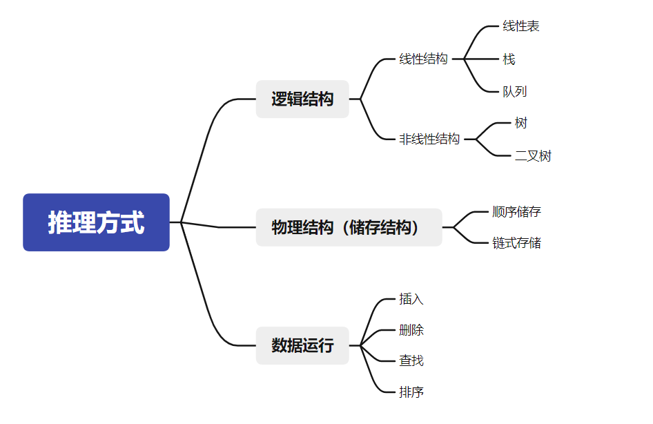


**数据结构：相互关联的数据元素的集合，例如：春夏春冬**


程序设计的实质就是：好算法+好结构


### 2.1 线性表的基本概念

**线性结构的4个的特征**：

- 有且只有一个头结点
- 有且只有一个尾结点

- 头结点为每个结点有切只有一个前件
- 尾结点为每个结点有切只有一个后件


### 2.2顺序表

线性表的顺序存储结构，简称：顺序表

**顺序表的特点**

- 空间必须连续
- 逻辑上连续的元素在"物理储存空间"上也必须连续


### 2.3顺序表的运算

- **插入元素时候**

  - 从插入的元素的索引开始每个元素为后移动一位

  - 时间复杂度：移动元素的个数

- **删除元素时候**

  - 从删除的元素的索引开始每个元素为前移动一位
  - 时间复杂度：移动元素的个数

小贴士：遇到


这种题，就直接模拟场景，带入值就行了


### 2.4 栈

栈就是个瓶子（一端开口，一端封闭），**先进后出**


栈顶(top)：可操作的端

栈底(bottom)：不可操作的端


#### 2.4.1 栈的特点

1.**先进后出**

2.栈的基本运算：

- 入栈：插入元素
- 出栈：删除元素

3.只能操作栈顶(top)


提示：带链的栈就是每个元素都有一个指针

所以：

带链的栈：栈底指针在操作过程中**会**改变，

顺序栈：栈底指针在操作过程中**不会**改变

​				**栈顶的指针都是动态的**

栈中，**栈底**指针不变，栈中指针随**栈顶**指针的变化而变化


### 2.5 队列

队列(queue) 就像**管道**， 两端开口 ， **先进先出**，

是仅限于在**队尾(rear)**插入，在**队头(front)**删除的线性表


#### 2.5.1循环队列

就是将队列存储空间的最后一个位置绕道第一个位置，形成逻辑上的环状空间(没啥用)

小提示：循环队列中头指针(front)，和尾指针(rear),在题目中可以随便定义，因为是循环队列，因为是一个○圆圈


#### 考点总结

1.队列“先进先出”，出口为队头，进入为队尾

2.循环队列是队列的一种顺序储存结构，因此储存空间按顺序连续定义

3.循环队列是线性结构

4.队列元素的个数计算方法

- 队列元素的个数 = rear(尾指针) - front(头指针)

  - rear-front为正数时，直接为元素个数
  - rear-front为负数时，元素个数是：rear-front+总容量

  - rear-front= 0，可能没有元素，可能满元素

  - 真题(1)：

    

    

    答案为：D 

  - 真题(2):

    

    答案为：A

  - 真题(3):

    

    答案为：D

  - 真题(4):

    

    答案为：D

  - 真题(5):

    

    答案为：D


### 2.6 线性链表

线性结构的顺序存储，为顺序表（栈，队列）

线性结构的链式存储，为线性链表

**线性链表**

里面每个元素是有2个部分组成：

- 数据域（value）   ---- > 元素
- 指针域（next）可以一个可以两个


#### 2.6.1 线性链表的基本概念

- 单向线性链表

  

  指向第一个结点的指针Head称为头指针，当head=Null为空表

- 双向线性链表

  

  两个指针，一个指向前件(指针左指针)，一个指向后件(指针右指针)

#### 2.6.2 带链的栈

栈是线性表，所以也可以采用链式存储


an为栈顶指针指向第二个元素，a1位栈底指针为0

就是在每个元素都加上一个**指针**


#### 2.6.3 带链的队列

队列是线性表，所以也可以采用链式存储


a1为队头指向后件a2，an为队尾指向0


#### 2.6.4  线性链表的基本运算

- 插入运算

  - 对栈而言

    将**栈顶**的指针指向第二个元素，

  - 对链表而言

    将两个元素之间的指针(前件，后件)，给到栈中**原栈顶**

- 删除运算

  删除链表元素，放到栈里

  - 对链表而言

    将要删除的元素的指针断开，然后将前件指针指向栈顶，后件指针指向栈的**"原栈顶"**

  - 对栈而言

    就是插入一个元素

#### 2.6.5 循环链表

对比与普通线性链表的特点：

-  在循环链表中增加一个表头节点指针指向第一个元素

- 循环链表有一个节点的指针不为空，而指向表头节点 

本来an的指针为Null，现在指向了表头结点


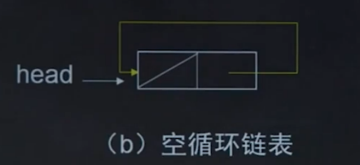


#### 考点总结

- 普通线性链表与循环链表中区别在于：**循环链表能访问链表中的任意一个元素**。
- 线性链表与循环链表的逻辑结构与存储结构
- 链式存储比顺序存储，占用存储空间更多。因为链式存储有指针区域和数据区域，而顺序存储，都为数据区

真题(1):

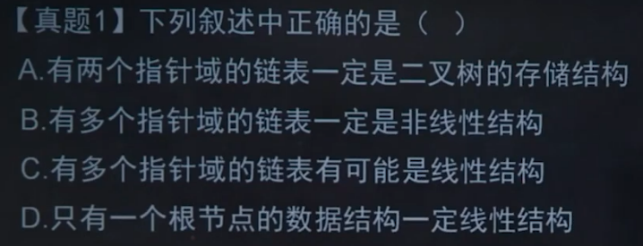

答案为：C

真题(2):

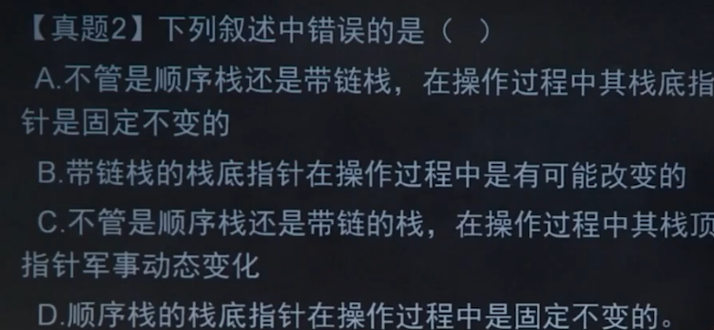

答案为：A

小提示：顺序栈栈底操作不变，带链的栈所有元素都会变

真题(3):

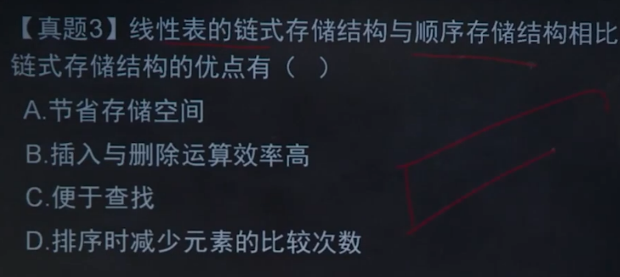

答案为：B

真题(4):

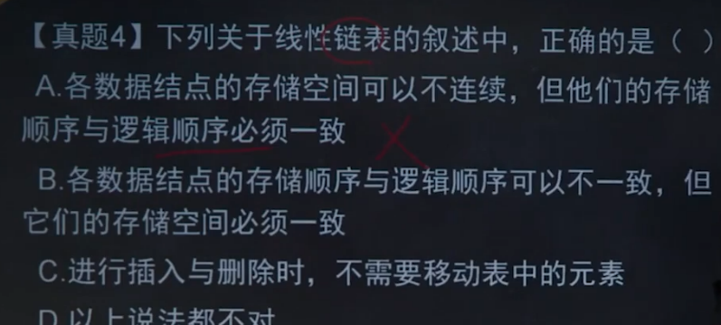

答案为：C

小提示：插入删除是，只需要改变指针，所以储存空间，和逻辑顺序不需要一致


### 2.7 非线性结构(必考一题)

主要内容：

- 树和二叉树

- 满二叉树
- 完全二叉树
- 二叉树的遍历*


#### 2.7.1树的基本概念：

树：最上面为根结点，下面都为结点(除了最后一层)，最后一层为叶子

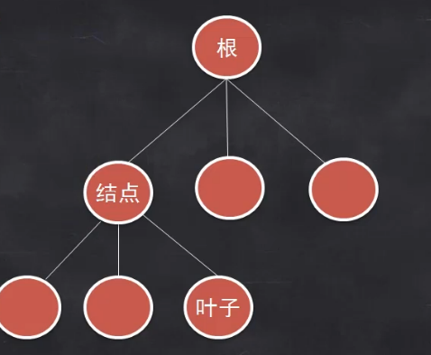

**树是n(n>=0)个结点的有限集合T**

T要满足：

1.有且只有特殊的结点，名字为根的结点

2.当你n>1时，其余结点可分为m个互不相等且有限的集T1，T2·········

其中每个集合本身有事一棵树

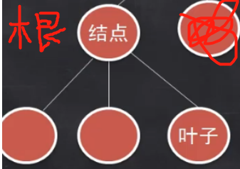


#### 2.7.2二叉树及其基本性质

二叉树：所有结点的叶子(叶子结点)最多为2

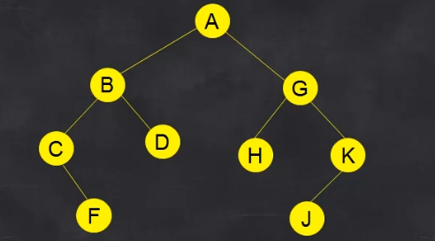

二叉树的形态

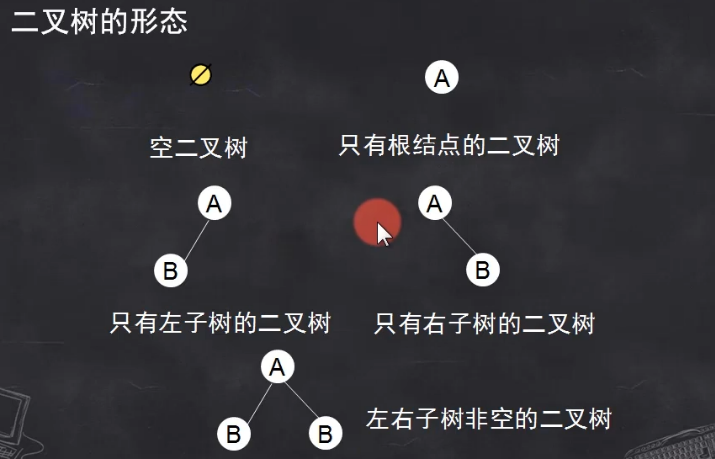


**二叉树的基本术语**

| 术语     | 概念                                                  |
| -------- | ----------------------------------------------------- |
| 结点     | 表示数种的元素，包含，数据项，及若干子数的分支        |
| 叶子结点 | 也叫终端结点，是度为0的结点，也就是后件为0的结点      |
| 度       | 某个结点所拥有的**后件**的个数，例如：二叉树最多度为2 |
| 分支结点 | 度不为0的结点                                         |
| 结点的度 | 拥有结点子树的个数                                    |
| 数的深度 | 树中最大的层数                                        |

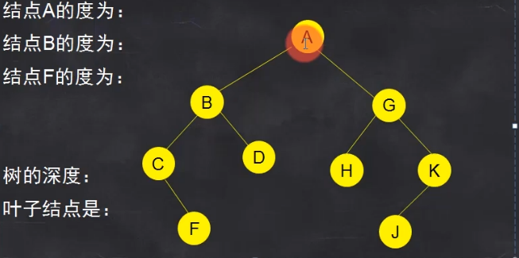

答案为：2 ；2 ；0 ； 4 ；FJDH


**二叉树的基本性质**

1.一颗非空二叉树的i层最多
$$
2^{i-1}
$$
个结点


2.一颗深度为K的二叉树，最多有
$$
2^k-1
$$


个结点


3.一颗二叉树中度为0的结点总是比，度为2的结点多一个


**验证：**


1. 深度i为2时，结点为2，公式带入也为2
2. 深度K为3时，结点一共为7，公式带入也为7
3. 

度为0个数：4  ； 度为1个数：2	；	度为2个数：3

总结点个数=度为0个数+度为1个数+度为2个数


- 满二叉树

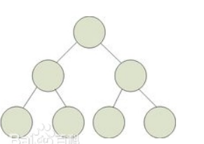

就是在二叉树的基础上，所以结点都占满


- 完全二叉树

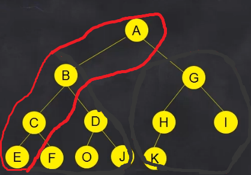

在满二叉树的情况下，以根结点分割，右侧最后一层叶子少若干个为完全二叉树


#### 2.7.3 二叉树的存储结构

二叉树通常采用链式存储

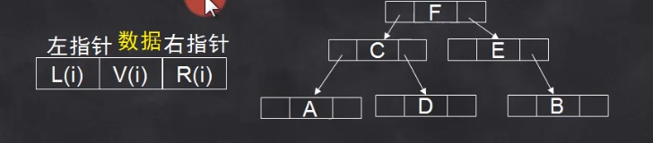


#### 2.7.4 二叉树的遍历(难点)

遍历是按照指定的次序访问二叉树的每一个结点，使每个结点访问一次

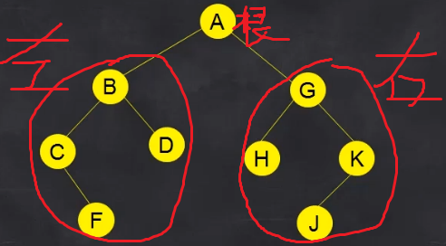

访问顺序为

- 前序遍历：根 --> 左  -->  右  ； 结果是：A  BCFD  GHKJ
- 中序遍历：左 --> 根 -->  右   ； 结果是：CFBD   A  HGJK
- 后序遍历：左 --> 右 -->  根   ； 结果是：FCD B HJK G  A


### 2.8 查找技术

#### 2.8.1顺序查找

- 基本方法：从线性表的一个元素开始，依次将线性表中的每个元素，与被查找的元素相比较，如果相等就找到了；如果都找完了没有成功，那就是查找失败了

- 顺序查找最多查找n次，最少查找1次，平均为
  $$
  \frac{n(n+1)}{2}
  $$
  次

- 优点：算法简单，适应面广

- 缺点：查找效率慢


#### 2.8.2二分法查找

二分查找又称折半查找

- 用二分查找要求表为有序表
- 查找的元素从中间开始对比
  - 如果比中间大，就往右找
  - 如果比中间小，就往左找

- 优点：效率高
- 缺点：仅限于有序表


#### 总结

- 顺序查找

  - 线性表**可以**为无序表
  - 表**可以**采用链式存储结构

- 二分法查找

  - 仅适用于顺序储存的有序表
  - 对于长度为n的有序线性表，最坏情况只需要比较次log<sub>2</sub>n次，如果为奇数就
  

### 2.9 排序技术

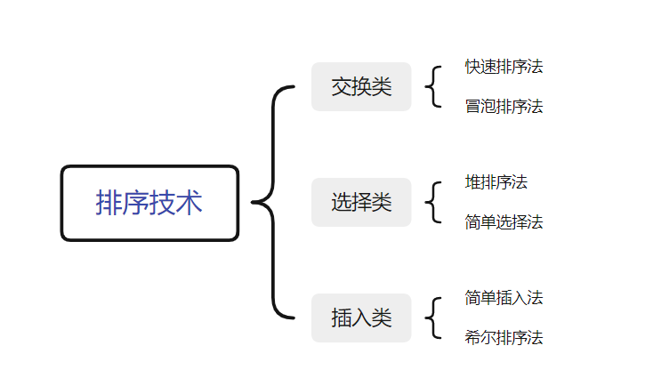

最快的为**"堆排序法"**，其次是**"希尔排序法"**

其他速度最快一样，速度都为
$$
\frac{n(n-1)}{2}
$$
的速度


#### 冒泡排序

初始状态【6 8 5 7 4】从小到大

- 第一遍

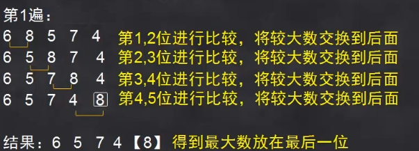

找到最大值放到最后


- 第二遍

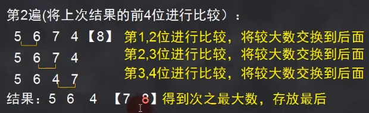

- 第三遍

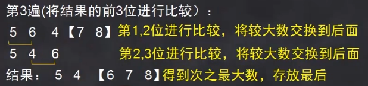

- 第四遍

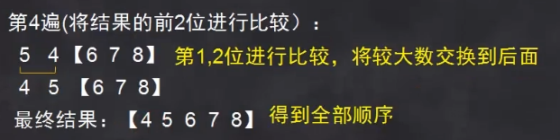

python中的冒泡排序简单实例

```sql
def bubbleSort(arr):
    n = len(arr) # 7
    # 遍历所有数组元素
    for i in range(n):
    	# i = 0~6
        for j in range(0, n-i-1):	# 7-0-1=6
            if arr[j] > arr[j+1] :	# 如果前一个比后一个大，就把两个索引交换位置
                arr[j], arr[j+1] = arr[j+1], arr[j]
 
arr = [64, 34, 25, 12, 22, 11, 90]
 
bubbleSort(arr)
 
print ("排序后的数组:")
for i in range(len(arr)):
    print(arr[i])
```


#### 选择法排序法

就是第一个跟全表比较，然后找出最大(最小)的放在最前面，然后第二比较，直到最后一个元素为止

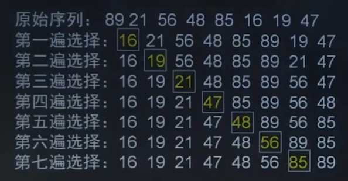


#### 堆排序法（效率最高）

堆的定义：

有n个元素，序列为（h1,h2,h3··········hn）当且仅当满足
$$
\begin{cases}
hi >=h2i\\
hi>=h2i+1
\end{cases}

或

\begin{cases}
hi <= h2i\\
hi<=h2i+1
\end{cases}

(i=1,2,3···,n/2)
$$
时称为堆，可以看出，堆顶的元素（第一个元素）必为最大（最小）


将数据以完全二叉树的表示堆结构

原数据：91,85,53,36,47,24,30,12

- 先建堆，搞出个完全二叉树

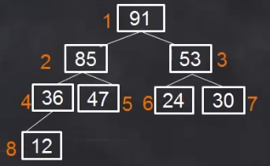


- 找出左子树和右子树的最小值交换给根结点

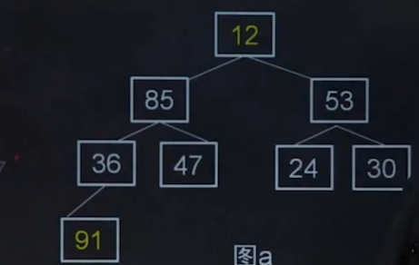


- 找出所有左子树和右子树（重下往上找）找出最大值给根结点（不包括）

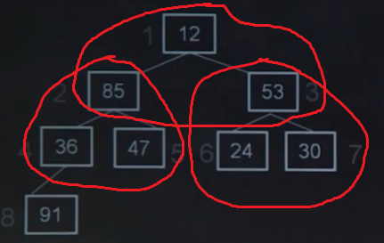

得出

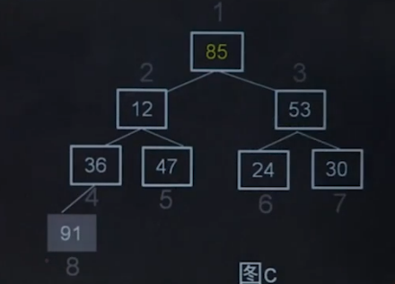

然后将根结点换到倒数第二索引

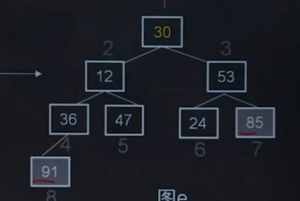

然后继续排序：找出所有左子树和右子树（重下往上找）找出最大值给根结点（不包括排好的结点）

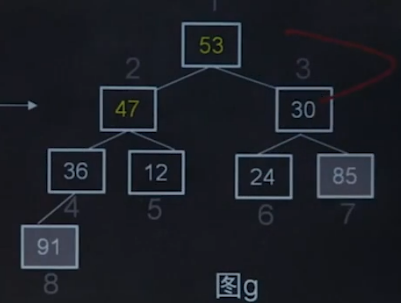

再把根结点放到倒数第三索引  

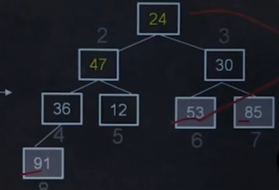

以此类推


#### 总结与真题

| 类型   | 排序方法             | 含义                                                       | 时间复杂度         |
| ------ | -------------------- | ---------------------------------------------------------- | ------------------ |
| 交换类 | 快速排序             | 选择基准元素，通过交换划分，成两个序列                     | n(n-1)\2           |
| 交换类 | 冒泡排序             | 相邻元素比较，满足条件时交换                               | n(n-1)\2           |
| 插入类 | 简单插入             | 自己看去吧                                                 | n(n-1)\2           |
| 插入类 | 希尔排序（效率第二） | 分割成若干个子序列，分别进行直接插入排序                   | n(n^1.5)           |
| 选择类 | 简单选择             | 扫描整个线性表，将最小的元素，交换到表最前面               | n(n-1)\2           |
| 选择类 | 堆排序法（效率第一） | 建堆，将堆排序，将对顶元素与堆最后一个元素交换，然后在排序 | n log<sub>2</sub>n |


真题1

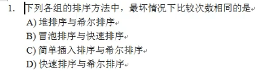

答案为：B


真题2

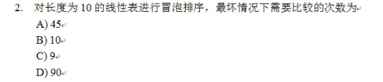

答案为：A


真题3

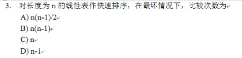

答案为：A


真题4

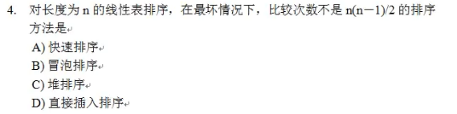


答案为：C


真题5

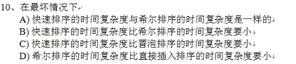

答案为D


真题6

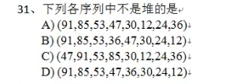

答案为：C 


真题7

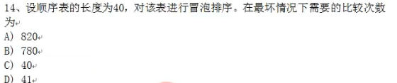

答案为：B


## 3.程序设计

- 程序

  解决一个具体问题而编写的一大堆代码(指令)的集合

- 程序设计

  编写程序的过程


### 3.1 程序设计方法和风格

- 良好的程序风格要考虑的因素**（考点）**

  1.原程序文档化

  - 符号名的命名
  - 程序注释
  - 视觉组织（为使程序结构一目了然，可以搞空格之类的）

  2.数据说明的方法（使程序更容易理解和维护）

  - 数据说明的次序规范化
  - 命名有序化（例如从ABCD）
  - 用注释来说明复杂的数据结构

  3.语句的结构（简单易懂，构造简单）

  - 一行一句
  - 清晰第一，效率第二
  - 避免使用临时变量，而使程序可读性下降
  - 尽可能使用库函数（直接可以用的函数）
  - 减少使用“否定”条件的条件语句，
  - 模块化
  - 不要修复不好的程序，要程序编写

  4.输入和输出

  - 数据的合法性
  - 检查输入项的合理性
  
  - 输入数据运行使用自由格式，应允许默认值

  - 输入一批数据时最好输入结束表（就是不要搞死循环）

  - 在交互式输入输出时，有提示或输入要求等


### 3.2 结构化程序设计

- 顺序结构
- 选择结构
- 循环结构


#### 3.2.1 结构化程序设计原则和方法(考点)

- 自顶而下
  - 顶  -- 全局	； 下 -- 局部
- 模块化
  - 将复杂的问题分为多个模块，分别实现局部明白
- 逐步求精
  - 精	-->   实现的意思
- 限制使用goto


#### 3.2.2 结构化程序的基本结构和特点

著名的结构化程序由三大结构组成：

1.顺序结构

2.选择结构（分支结构）

3.循环结构（重复结构）


在python里

- **顺序结构**

  语句从上到下，从左到右的顺序执行

- **选择结构（分支结构）**

  if	else	elif

- **循环结构**

  while   for


结构化程序特点：

每个控制结构只有

- 只有一个入口

- 只有一个出口

- 结构内每一条语句都有机会被执行到
- 结构内不允许出现死循环


#### 2.2.3 面向对象的基本概念

- 对象

  对象的特征【考点】

  - 表示唯一性	（类名不能一样）
  - 分类性      （指可以将相同属性和操作的对象抽象成类）
  - 多态性       （指同一操作可以是不同对象的行为）
  - 封装性        （只能在对象内部才能调用）
  - 模块独立性 （对象是面向对象的软件的基本模块）


- 类

  - 将属性、操作相似的对象归为类，具有抽象性

  - 当类实例化后就成了对象


- 消息

  - 消息是一个实例与另一个实例之间传递的信息


- 继承（了解）
  - 就是一个类继承另一个类的成员


- 多态性（了解）
  - 同样的消息被不同的对象接受时可导致完全不同的行动，这个现象为多态性（高教版就这么说，很明显这跟放屁没区别）


#### 相关考题：

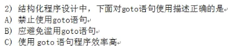

答案为：B		


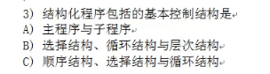


答案为：C


- 真题1

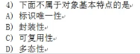

答案为：C


- 真题2


答案为：C


- 真题3

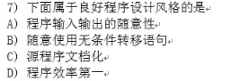

答案为：C


## 4.软件工程基础

软件定义：程序，数据，相关文档的集合


### 4.1软件工程基础的概念

#### 4.1.1软件的分类：

- 系统软件：win10，mac，linux，安卓
- 工具软件：java，python，VB，C语言
- 应用软件：用工具软件开发出来的教应用软件，QQ，微信等，教育系统


#### 4.1.2软件危机

软件危机是指在计算机软件的开发和维护过程中遇到一系列严重的问题


- 软件危机的具体表现（就考个1次）

1.软件的需求增长，得不到满足

2.软件的开发成本和进度无法控制

3.软件的质量难以保障

4.软件的不可维护或维护程度低

5.软件的成本不断提高

6.软件开发生产效率赶不上硬件的发展和应用需求的增长


#### 4.1.3 软件工程的概念

为消除软件危机，软件工程师解决问题的途径

软件工程：用工程、科学和数学的原理与方法研制、维护计算机软件的有关技术及管理方法


**软件工程的三要素**：（考点）

- 方法：方法，是完成软件工程项目的技术手段
- 工具：工具，支持软件的开发管理，文档生成
- 过程：过程，支持软件开发的各个环节和控制、管理

考题为欢乐4选1，


**软件过程与软件生命周期**：（考点）

**软件过程**：软件过程通常包含4种基本活动：

- P（plan）	软件规格说明
- D（do）	   软件开发或软件设计与实现
- C（check）  软件确认
- A（action） 软件演进


**软件生命周期：**软件周期可以划分成三个阶段（**重点）（考点）**

​	定义阶段	--->       开发阶段	--->		维护阶段

 

- 定义阶段：可行性研究	；	**需求分析**
- 开发阶段： **总体设计（概要设计）**    ；   详细设计       ；    编码       ；     测试调试

- 维护阶段；   使用        ；       维护         ；       退役


**软件生命周期，各个阶段的基本任务：**（重点）

**可行性研究  —>   需求分析  —>  软件设计 (总体设计) —>  软件编码 —> 软件测试  —>   软件运行维护**


#### 4.1.4 软件工程的目标与原则

- 软件工程的目标：软件工程的目标是在给定**成本，进度**的前提下，开发出具有**有效性，可靠性，可理解性，可维护性，可重用性，可适应性，可移植性，可追踪性，可操作性**且满足用户需求的产品

包括了 **软件开发技术**、**软件工程管理技术**（基本不考）


- 软件工程的基本原则

  **1.抽象			2.信息隐蔽**

  **3.模块化		4.局部化**

  **5.确定性		6.一致性**

  **7.完备性        8.可验证性**


- 软件开发工具

  软件工具主要包括：“分析工具”，“设计工具”，“编码工具”，“确认工具”，“维护工具”


- 软件工具环境
  - 软件开发环境是全面支持软件开发全过程的。软件工具集合
  - 计算机辅助软件工程（CASE）是将各种工具，开发机器和存放开发过程信息组合起来，形成环境

 


### 4.2 结构化分析方法

主要内容：

- 需求分析
- 需求分析方法
- 结构化分析工具


#### 4.2.1 需求分析与需求分析方法

**1.需求分析**

需求分析的工作（考点）

- 需求获取
- 需求分析
- **编写需求规格说明书** （软件功能的说明）  -- 重点

- 需求评审


**2.常见的需求分析方法**

- 结构化分析法：
  - 面向数据流的结构化分析法（SA）
  - 面向数据结构的 jacson（JSD）
  - 面向数据结构的结构化数据系统开发方法（DSSD）
- 面向对象的分析方法（OOA）


#### 4.2.2 结构化分析方法

1.结构化分析方法的实质：（考点）

	- 通过对用户的调查，以软件的需求为线索，获得当前系统的具体模型。

- 去掉具体模型中非本质。因素，抽象出当前系统的逻辑模型

- 根据计算机的特点分析当前系统与目标系统的差别，建立目标系统的逻辑模型。

- 完善目标系统并补充细节，写出目标系统的软件需求规格说明
- 评审直到确认，完全符合用户对软件的需求

就是画一大堆图


2.结构化分析的常用工具（考点）

- **数据流图（DFD）**  -- 重点

- 数据重点
- 判定树
- 判定表


**(1)数据流图：**

数据流图是描述数据处理过程的工具。数据流图中的主要图像元素说明：

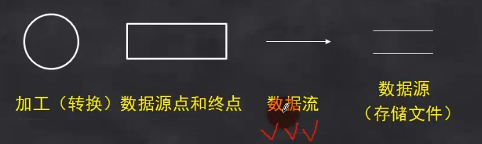

一般是 ” 数据流 用什么 图形表示 “   -- > 箭头


**(2)数据字典（DD）：**

例如：

存折 = 户名 + 账户 + 性质 + ······

户名=2{字母}24

性质=“1”··“6”

·····················


**(3)判定数**（了解）

 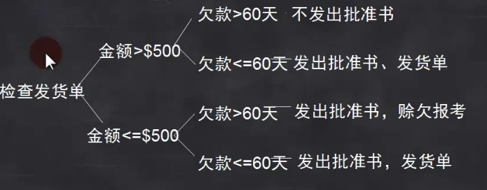

九折，了解


判定表（了解）

了解！！！！！！！！！！


#### 4.2.3 软件需求规格说明书

软件需求规格说明书是描述需求中的重要文档，是软件需求分析的主要成果

**作用：**

- 便于用户，开发人员理解和交流

- 反应用户问题的结构，，可以作为软件开发工作的基础和依据
- 测试确认和验收
- 为成本估算提供依据


**特点：**

- 正确性
- **无歧义性（对每个需求1只有一种解释，陈述具有唯一性）**——>  重点
- 完整性
- 可验证性
- 可修改性
- 可追踪性
